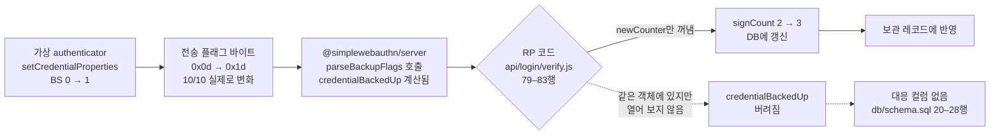
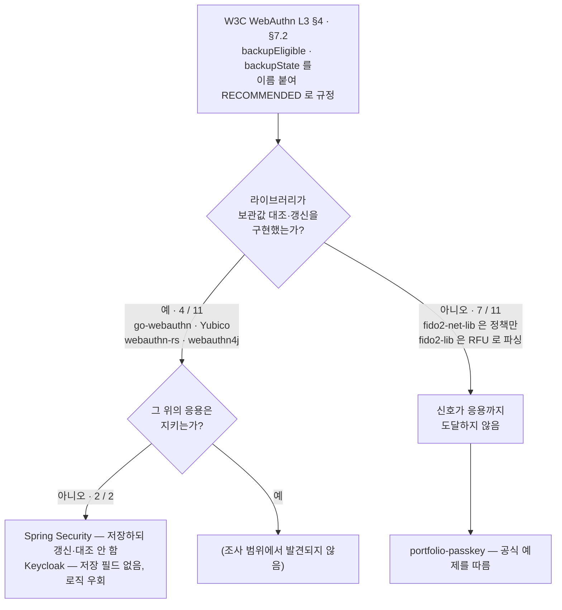

# 동기화 패스키의 백업 상태 전이는 서비스에 관측되는가

### — WebAuthn BE/BS 플래그의 소비 실태: 배포된 RP 1개의 반복 측정과, 오픈소스 라이브러리 11개·응용 3개의 횡단 조사

**작성자**: 진혜정
**작성일**: 2026년 9월 10일
**분야**: 정보보안 — 인증(Authentication)

---

# 초록

**문제의식.** FIDO2/WebAuthn은 "개인키가 인증장치를 벗어나지 않는다"는 전제 위에 세워졌으나, 애플·구글이 개인키를 클라우드에 동기화하는 패스키를 소비자 인증의 기본 경로로 채택하면서 이 전제는 자격증명 유형에 따라 달라지는 조건부 명제가 되었다. 미국 NIST는 2024년 보충 지침에서 "동기화는 AAL3의 비수출성 요구사항을 위반한다"고 명시하는 한편, 검증자가 Backup Eligibility(BE) 플래그를 근거로 정책을 세울 수 있다고 규정했다. 즉 표준은 이미 서비스 제공자(RP)에게 판단 근거를 주고 있다. 그렇다면 RP는 그 신호를 실제로 쓰고 있는가?

**방법.** 두 가지 실험을 수행했다. 실험 A는 필자가 직접 구현·배포한 패스키 인증 시스템을 대상으로, Chrome DevTools Protocol의 가상 authenticator로 BE/BS 플래그를 직접 제어하며 RP의 반응을 관측했다. 세 시나리오(동기화 / 기기 전용 / 등록 후 동기화 전이)를 각 10회, 총 30회 반복하고 공개 배포본으로 1회씩 대조했다. 수집 종료 후 역방향 전이(등록 후 동기화 해제) 시나리오를 더해 10회를 추가 측정했다. 실험 B는 오픈소스 WebAuthn 구현체를 두 층위로 나누어 조사했다. 라이브러리 11개가 BE/BS를 노출·저장·재확인하는지 네 항목으로 보고, 그 라이브러리를 쓰는 응용 3개가 신호를 지키는지를 따로 보았다. 1차 조사(문서 기반)에서 미판정으로 남은 8칸은 각 저장소를 내려받아 소스를 직접 읽어 0으로 줄였고, 그 과정에서 판정 3건이 갱신되었다.

**결과.** 실험 A는 세 시나리오를 각 10회씩 총 30회 실행했다. 그중 전이(BS 0→1)를 다루는 시나리오 3의 10회 전부에서, 전송된 플래그 바이트가 `0x0d`에서 `0x1d`로 실제로 바뀌었음에도 로그인 응답 본문은 완전히 같았고, 서버가 보관한 자격증명 레코드도 로그인 횟수(`signCount`)를 빼면 완전히 같았다(각 10/10). 공개 배포본에서도 동일했다. 추가한 역방향 전이(BS 1→0)에서도 결과는 대칭이었다 — 플래그가 `0x1d`에서 `0x0d`로 바뀌고 그 사이 BE가 1로 유지되었음에도(각 10/10) 서버 쪽 변화는 없었다. 이때 전송되는 `0x0d`는 "한 번도 백업된 적 없는 자격증명"이 보내는 바이트와 같은 값이어서, 보관해 둔 값이 없는 RP는 두 상태를 구별할 수단 자체를 갖지 못한다. 실험 B는 가설을 기각했으며, 기각의 내용이 이 연구의 주된 발견이 되었다. 조사한 라이브러리 11개 중 9개가 BE/BS를 노출했고, 그중 **4개(go-webauthn·Yubico·webauthn-rs·webauthn4j)는 보관값과의 대조와 갱신까지 구현**하고 있었다. 특히 webauthn4j는 이 검증을 전담하는 클래스를 따로 두고 있다. 즉 **라이브러리 층위는 규격을 따라잡았다.** 그런데 그 라이브러리를 쓰는 응용은 달랐다 — Spring Security는 등록 시 두 값을 컬럼까지 만들어 저장하면서 인증 시에는 갱신하지 않고 보관값을 라이브러리에 넘기지도 않아, webauthn4j의 대조 로직이 무동작으로 통과한다. Keycloak은 저장 필드가 아예 없고 구식 인터페이스를 써서 같은 로직을 우회한다. 필자의 시스템은 세 번째 사례였다. 규격 원문을 직접 대조한 결과, 이 저장·검증 절차는 표준이 침묵한 자리가 아니라 2023년 WebAuthn 워킹그룹이 명문화하여 `backupEligible`·`backupState`라는 이름까지 붙여 권고(RECOMMENDED)한 것으로 확인되었다.

**결론.** 신호가 끊기는 곳은 규격과 라이브러리 사이가 아니라 **라이브러리와 응용 사이**다. 규격은 이름까지 정해 권고했고 주요 라이브러리는 그것을 구현했는데, 그 라이브러리를 쓰는 응용에서 값이 사라진다. 조사한 응용 3개가 모두 그랬고, 그중 둘은 규격을 완전히 구현한 라이브러리 위에 서 있었다. 규격이 `signCount`와 `backupState`를 같은 문장의 같은 권고 목록에 적어 두었음에도 측정 대상 서버가 앞의 것만 저장한 것은, 이 전달 구간에서 반복해 나타나는 양상의 한 사례다.

**키워드**: FIDO2, WebAuthn, 패스키, 동기화 패스키, Backup State, 위협모델, 인증장치 확증수준(AAL)

---

# 목차

1. **서론** — 관심 분야 / 주제 선정 / 가설 / 기각 조건 / 이미 알려진 사실과 새로 주장하는 것
2. **배경 및 선행연구** — FIDO2 구조 / 플래그 바이트 / **BE와 BS의 비대칭(2.3절, 이 연구의 핵심 근거)** / 동기화 구현 / 문헌별 연결 / 출처 확인 방법
3. **방법** — 실험 A(단일 시스템 동적 측정) / 실험 B(라이브러리 11개 + 응용 3개 횡단 조사, 1차·2차) / 재현 절차 / 설계 변경 이력
4. **결과** — 실험 A(상승 전이 30회 + 역전이 포함 확장 40회) / **실험 B(라이브러리 층위와 응용 층위, 정정 3건 포함)** / **가설대로 나온 부분과 다르게 나온 부분(4.3절)** / 다르게 나온 이유 / 가설 수정
5. **논의** — 위협모델에서의 의미 / 사각지대를 메우는 비용 / 대안의 부재 / **이 연구로 말할 수 없는 것(5.4절)**
6. **결론**
- 참고문헌 · 부록 A(재현 방법) · 부록 B(AI와 나의 판단) · 부록 C(문헌 재확인 기록과 후속 과제 예비 확인)

표 21개(표 1~21)와 그림 2개(그림 1~2)를 본문과 부록에 붙였다.

---

# 1. 서론

## 1.1 관심 분야와 출발점

필자의 관심 분야는 **정보보안, 그중에서도 인증(authentication)** 이다. 앞선 과제에서 세션·토큰 기반 인증과 행 수준 보안(RLS)을 직접 구현했고, 이어서 패스키(WebAuthn)만으로 계정을 여는 시스템을 설계·배포했다. 이 과정에서 남은 의문이 이 연구의 출발점이 되었다.

## 1.2 주제 선정 과정

관심 분야를 좁히기 위해 AI와 함께 후보를 넓게 벌린 뒤 "내가 직접 데이터를 모을 수 있는가"를 기준으로 걸러냈다. 최종적으로 검토한 후보와 접은 이유는 다음과 같다.

**표 1 — 검토한 후보 주제와 접은 이유**

| 후보 주제 | 접은 이유 |
|---|---|
| **FIDO2 하드웨어 격리 키 기반 소유권 증명(PoP) 게이트웨이의 설계 및 성능 분석** | 이 방향은 하드웨어 격리를 전제로 삼고 그 위에 시스템을 얹어 지연시간과 처리량을 재는 성능 연구가 된다. 게이트웨이를 새로 만들고 부하를 걸어 측정하는 작업이 주어진 기간에 감당하기 어려웠고, 이미 비슷한 접근이 공개되어 있어 새로 더할 것도 많지 않았다. 다만 이 주제를 검토하는 동안 **"그 하드웨어 격리라는 전제 자체가 동기화 때문에 흔들리고 있다"** 는 반대 각도가 눈에 들어왔고, 그쪽이 더 답할 가치가 있는 질문이라고 판단했다. |
| **서버리스 환경에서 속도 제한(rate limiting) 설계의 한계** | 8번 과제에서 실제로 구현해 본 경험이 있어 접근성은 좋았으나, 바꿔 볼 독립변수가 빈약했다. "요청을 많이 보내면 막힌다"를 확인하는 것에 그쳐 보안 연구라기보다 엔지니어링 회고에 가까웠다. |
| **OAuth Device Code Flow를 악용한 피싱** | 실제 공격 사례가 보고된 흥미로운 주제였으나, 필자가 직접 구현하거나 측정해 본 적이 없어 데이터를 스스로 모을 수 없었다. 남의 사례를 인용해 정리하는 글이 될 뿐 검증 과정이 들어가지 못한다. |
| **동기화 패스키가 FIDO2 위협모델에 미치는 영향** ← **선택** | 아래 1.3 참조 |

**최종 주제를 고른 이유.** 세 가지가 맞아떨어졌다. 첫째, 필자가 이미 패스키 인증 시스템을 직접 구현해 공개 배포까지 해 두었으므로 **측정 대상이 손안에 있었다**. 둘째, 크롬 개발자 프로토콜의 가상 authenticator가 BE/BS 플래그를 직접 지정하고 사후에 변경까지 할 수 있어, 실제 아이폰이나 보안키 없이도 **원하는 조건을 정확히 만들어 반복 측정**할 수 있었다. 셋째, 결과가 어느 쪽으로 나오든 의미가 있었다 — 신호가 버려지고 있다면 사각지대의 실증이고, 잘 쓰이고 있다면 "표준이 준 신호가 실제로 작동한다"는 확인이 된다.

**AI와 가설을 다듬은 과정.** 처음 AI에게 던진 질문은 "보안 쪽에서 흔하지 않은 논문 주제"라는 막연한 것이었고, 돌아온 첫 제안은 "동기화 패스키가 FIDO2 위협모델을 어떻게 바꾸는가"라는 여전히 큰 주제였다. 이것을 가설로 좁히는 데 세 번의 되물음이 필요했다. ① "이걸 어떻게 측정하지?" — 위협모델 자체는 측정 대상이 아니므로, 표준이 정의한 관측 가능한 신호인 BE/BS 플래그로 대상을 바꿨다. ② "내가 직접 데이터를 모을 수 있나?" — 실제 기기로는 어렵다는 답이 나와, 가상 authenticator로 조건을 만드는 방법을 찾았다. ③ "결과가 반대로 나오면 그것도 의미가 있나?" — 있다고 판단해 진행했고, 실제로 실험 B에서 반대 결과가 나왔다(4.3절). 또한 AI가 제시한 선행연구 목록을 그대로 받지 않고 전수 확인한 결과 서술 오류 네 건을 찾아 고쳤다(2.6절).

## 1.3 가설

> **자격증명의 백업 상태(BS)가 "기기 전용"에서 "클라우드 동기화"로 전이해도, WebAuthn 표준을 정석대로 따른 RP 구현에서는 서버의 응답과 저장 상태가 달라지지 않는다.**

- **무엇이(원인, 독립변수)**: 자격증명의 백업 상태 전이 (BS: 0 → 1)
- **무엇에(결과, 종속변수)**: RP의 관측 가능한 반응 — 응답 본문, 저장된 자격증명 레코드, 재인증·경고 등 부가 동작
- **영향의 방향**: **영향을 주지 않는다.** 전이가 일어나도 RP 쪽에는 변화가 없다는 것이 이 가설의 내용이다.

## 1.4 가설이 틀렸다면 나올 결과

다음 중 하나라도 관측되면 가설은 기각된다. 이 기각 조건은 데이터 수집 착수 전에 설계서에 고정해 두었다.

- **R1** — BS 전이 전후의 로그인 응답 본문이 서로 다르다.
- **R2** — 전이 후 서버가 저장한 자격증명 레코드에 변화가 생긴다.
- **R3** — 전이가 재인증 요구, 경고 표시 등 별도 동작을 유발한다.
- **R4** — 조사 대상 구현체 다수가 등록 시 BE/BS를 저장하고 인증 시 재확인한다.

## 1.5 이미 알려진 사실과 이 연구가 새로 주장하는 것

혼동을 막기 위해 미리 구분해 둔다.

**이미 알려진 사실 (선행연구·표준 문서에 있음)**
- 동기화 패스키는 개인키를 클라우드로 확장하며, 그 보안은 사실상 패스키 제공자에게 집중된다[5].
- 동기화 인증장치는 AAL2까지 가능하고 AAL3의 비수출성 요구는 위반한다[2].
- BE는 자격증명의 영구 속성이고 BS는 시간에 따라 변할 수 있다[1].
- 실무 지침은 BS가 등록과 인증 사이에 변할 수 있으므로 지속적 모니터링이 필요하다고 권고한다[10].
- 클라우드 패스키 저장소가 침해될 수 있으며, 이를 탐지하는 프레임워크가 제안된 바 있다[3].
- 일부 RP 구현에는 고위험 취약점이 존재한다 — Jannett 등은 패스키를 지원하는 872개 사이트의 구현·관리 실태를 조사하고 그중 103개를 정밀 평가해, 53개에서 높은 CVSS 점수의 공격이 최소 한 건 성립했고 103개 중 18개에서 치명적 취약점을 찾았다[19].

**이 연구가 새로 주장하는 것**
- 백업 상태 전이가 실제 배포된 RP에서 **전혀 관측되지 않음**을 반복 측정으로 실증한다(4.1절). 선행연구가 권고한 "지속적 모니터링"이 실제로 이뤄지지 않는다는 것을 데이터로 보인 것은, 필자가 확인할 수 있었던 범위 내에서는 처음이다. 다만 Jannett 등[19]이 872개 사이트를 조사하며 이 질문을 이미 다뤘을 가능성을 배제하지 못한다 — 공개된 초록과 아티팩트 저장소 문서에는 BE/BS 언급이 없었으나(2026-09-11 재확인, 부록 C) 본문 전문을 열람하지 못했다(5.4절). 이 주장은 그 확인이 이뤄지기 전까지 잠정적이다.
- 그 누락이 개별 구현의 특성이 아니라 구조적 양상임을 구현체 조사로 보인다(4.2절). 원인의 위치는 조사 근거를 문서에서 소스로 끌어올리면서 더 정확해졌다 — **라이브러리와 응용 사이의 전달 구간**이다(4.2절).
- 규격을 완전히 구현한 라이브러리 위에 서 있는 응용조차 신호를 잃는다는 것을, 같은 라이브러리(webauthn4j)를 쓰는 두 응용(Spring Security·Keycloak)에서 보인다. 이는 필자 시스템의 누락이 개별 사례가 아님을 뒷받침한다(4.2절).
- 동시에 신호를 지키는 라이브러리들이 존재한다는 반례를 함께 제시한다(4.3절).

---

# 2. 배경 및 선행연구

## 2.1 FIDO2/WebAuthn의 구조

WebAuthn 등록 시 인증장치는 RP별 키 쌍을 만들고 **공개키만** 서버에 전달한다. 인증 시에는 서버가 발급한 일회용 challenge에 개인키로 서명하고, 서버는 저장한 공개키로 검증한다.

여기서 짚어야 할 구분이 있다. FIDO2의 두 핵심 보안 속성인 **서버 침해 내성**(서버에 공개키만 있으므로 유출돼도 로그인 불가)과 **피싱 저항성**(서명 대상에 origin이 포함되므로 피싱 사이트의 서명은 무효)은 **개인키가 기기를 벗어나는지와 무관하게 유지된다.** 동기화가 바꾸는 것은 이 두 속성이 아니라 **개인키에 접근할 수 있는 경로의 수와 성격**이다. 이 구분은 논문 전체에서 중요하다 — 동기화 패스키는 "취약한" 것이 아니라 "다른 신뢰 경계 위에 있는" 것이다.

## 2.2 authenticatorData의 플래그 바이트

모든 WebAuthn 응답에는 `authenticatorData`가 실린다. 구조는 RP ID 해시 32바이트, **플래그 1바이트**, 서명 카운터 4바이트, 이후 선택 필드 순이다. WebAuthn Level 3[1]이 정의한 플래그 비트 배치는 다음과 같다.

**표 2 — `authenticatorData` 플래그 바이트의 비트 배치** (WebAuthn Level 3[1])

| 비트 | 마스크 | 이름 | 의미 |
|---|---|---|---|
| 0 | 0x01 | UP | 사용자가 물리적으로 조작했는가 |
| 2 | 0x04 | UV | 생체인식·PIN으로 사용자를 확인했는가 |
| 3 | 0x08 | **BE** | 이 자격증명이 백업·동기화될 수 있는 종류인가 |
| 4 | 0x10 | **BS** | 이 자격증명이 현재 백업된 상태인가 |
| 6 | 0x40 | AT | 첨부된 자격증명 데이터 포함 |
| 7 | 0x80 | ED | 확장 데이터 포함 |

이 배치는 측정 대상 시스템이 사용하는 라이브러리 `@simplewebauthn/server` v13.3.3의 소스(`esm/helpers/parseAuthenticatorData.js` 18–23행)에서도 동일하게 확인된다[8].

## 2.3 BE와 BS의 비대칭 — 이 연구의 핵심 근거

두 플래그는 이름이 비슷하나 시간적 성격이 정반대이며, 이 비대칭이 가설의 토대다.

- **BE는 불변이다.** 규격은 백업 적격성을 "자격증명의 속성이며 주어진 공개키 자격증명 소스에 대해 영구적"이라고 규정한다[1].
- **BS는 가변이다.** 규격은 BS를 "해당 자격증명을 사용한 임의의 ceremony에서 관찰된 최신 값"으로 정의하며, 백업 상태가 시간에 따라 변할 수 있음을 명시한다[1]. 사용자가 등록 후 클라우드 동기화를 켜면 그때부터 BS=1이 실려 온다.

Yubico의 고보증 RP 구현 가이드는 이를 실무 언어로 옮겨 "BS는 등록과 인증 사이에 변할 수 있으므로 지속적인 모니터링이 필요하다"고 못박는다[10]. webauthn-rs의 소스 주석도 같은 사실을 적어 두었다 — "등록 이후 바뀌었을 수 있다"[21].

**즉 BS는 등록 시점 1회 확인으로는 충분하지 않은 신호다.** 이 연구는 정확히 그 지점을 측정한다.

**표준은 이 문제를 실제로 다룬 적이 있다 — 그리고 이미 결론까지 냈다.** 2022년 8월, W3C WebAuthn 저장소의 이슈 #1791("Enforce backup eligibility during assertion")[20]에서 Firstyear가 정확히 이 공백을 지적했다. BE=1→0으로 바뀌거나 BE=0인데 BS=1인 — 규격상 있을 수 없는 — 조합이 인증 응답에 실려 왔을 때 RP가 무엇을 해야 하는지에 대해 당시에는 **"규범적이든 비규범적이든 어떤 지침도 없다"**(emlun, 2022-08-30 코멘트)는 것이 논의의 출발점이었다. SimpleWebAuthn의 관리자 MasterKale도 이 논의에 참여해, "이미 널리 쓰이는 라이브러리 몇 개가 `be:0, bs:1`을 저자 개인의 판단으로 거부하고 있으며, 공식 입장이 없어 생태계가 파편화되고 있다"고 인정했다.

이 논의는 방치되지 않았다. MasterKale이 2023년 6월 14일 Pull Request #1907("Define RP processing of be and bs flags during .create() and .get()")을 열어 정확히 그 처리 절차를 규격에 새로 써 넣었고, 같은 해 8월 9일 병합되었다. 이슈 #1791은 그 직후인 2023년 8월 30일 "completed"로 종결되었다[20]. 본 연구는 규격 본문(GitHub `w3c/webauthn` 저장소의 `index.bs`, 2026-09-11 확인)에서 그 결과를 직접 대조했다. 현재 §7.2 "Verifying an Authentication Assertion"의 검증 절차("RP MUST proceed as follows")에는 다음 두 단계가 들어 있다.

> "If the BE bit of the flags in authData is not set, verify that the BS bit is not set."
>
> "If the credential backup state is used as part of RP business logic or policy, let currentBe and currentBs be the values of the BE and BS bits [...] Compare currentBe and currentBs with credentialRecord.backupEligible and credentialRecord.backupState: (1) If credentialRecord.backupEligible is set, verify that currentBe is set. (2) If credentialRecord.backupEligible is not set, verify that currentBe is not set. (3) Apply RP policy, if any."[1, §7.2]

첫 번째 단계는 **조건 없이 모든 RP에게 요구되는 검증**이다 — `be:0, bs:1`을 거부하는 것은 이제 저자 개인의 취향이 아니라 규격 준수의 문제다. 두 번째 단계는 "RP가 백업 상태를 정책에 쓰는 경우에 한해" 적용되는 **조건부 요구**이며, 이 단계를 수행하려면 등록 시점의 BE 값이 이미 저장되어 있어야 한다 — 그리고 규격은 그 저장소를 스스로 "Credential Record"라는 이름의 추상 구조로 규정해 두었다. 같은 문서는 RP가 등록된 자격증명마다 "credential record"를 보관한다고 전제한 뒤, "§7.1 등록과 §7.2 인증 검증의 모든 단계를 규정대로 구현하기 위해 **권장되는(RECOMMENDED)** 항목"으로 여덟 개를 이름 붙여 나열한다 — `type`, `id`, `publicKey`, `signCount`, `transports`, `uvInitialized`, `backupEligible`, `backupState`[1, §4 Credential Record].

**이 목록의 구성이 4.1절 결과를 읽는 열쇠다.** `signCount`와 `backupState`는 서로 다른 문서의 서로 다른 권고가 아니라 **같은 문장이 묶어 놓은 같은 목록의 이웃 항목**이다. 둘 다 "매 인증마다 갱신되는 가변 상태"라는 성격까지 같다. 그런데 4.1절에서 보듯 측정 대상 서버는 앞의 것은 성실히 저장하고 증가시키면서 뒤의 것은 저장할 컬럼조차 만들지 않았다. 규격의 권고를 통째로 모르는 상태가 아니라, **같은 목록에서 앞쪽 항목만 구현하고 뒤쪽 두 항목을 빠뜨린 상태**인 것이다.

**즉 표준은 침묵하지 않았다. 이름까지 정해 권고했다.** 이 사실은 4.1·4.2절의 해석을 바꾼다 — SimpleWebAuthn이 `be:0, bs:1`을 거부하는 것과 go-webauthn이 상태를 갱신하는 것은 "규격이 비운 자리를 저자가 메운" 임의의 선택이 아니라, 전자는 지금은 무조건적인 규격 준수이고 후자는 규격이 이름까지 정해 권고한 저장 모델을 실제로 구현한 것이다. 그렇다면 남는 질문은 하나다 — **규격이 필드 이름까지 정해 권고했는데도, 실제 생태계는 왜 대부분 그것을 따르지 않는가?** 4.2절의 조사가 이 질문에 답한다.

## 2.4 동기화 패스키의 구현

**애플(iCloud 키체인).** 패스키는 종단간 암호화되어 동기화되고, HSM 클러스터에 에스크로된다. 복구하려면 Apple 계정 암호, 등록된 전화번호로 온 SMS, iCloud 보안 코드가 필요하며, HSM은 SRP로 보안 코드 지식을 검증한다(코드 자체는 애플에 전송되지 않는다). 인증 시도는 10회로 제한되고, 10번째 실패 시 HSM 클러스터가 에스크로 레코드를 파기한다[6].

**구글(비밀번호 관리자).** 개인키는 기기에서 하드웨어로 보호된 키로 암호화된 뒤 종단간 암호화 상태로만 업로드되며, 화면 잠금이 지식 요소로 요구된다. 새 기기에서 복구하려면 Google 비밀번호 관리자 PIN 또는 기존 기기의 화면 잠금을 알아야 한다[7].

두 구현 모두 암호학적으로 견고하다. 다만 둘 다 **"사용자의 플랫폼 계정과 그 복구 절차가 안전하다"는 새로운 전제**를 도입하며, 이 전제는 기존 FIDO2 위협모델에 없었다.

## 2.5 선행연구와 가설의 연결

각 문헌이 이 연구의 가설 중 **어느 부분을 뒷받침하는지** 한 줄로 붙인다.

**표 3 — 각 문헌이 가설의 어느 부분을 뒷받침하는가**

| 문헌 | 가설과의 연결 |
|---|---|
| W3C WebAuthn L3[1] | BE/BS의 정의와 "BS는 변할 수 있다"는 규범적 근거 — 가설의 **독립변수**가 실재함을 보증한다. |
| NIST SP 800-63B 보충[2] | 동기화가 AAL3 요건을 위반한다는 것과 "검증자는 BE로 정책을 세울 수 있다"는 규정 — 가설이 다루는 **신호가 정책적으로 유의미**함을 뒷받침한다. |
| Islam 등, CASPER[3] | 클라우드 패스키 유출이 실재하는 위협임을 전제로 탐지 프레임워크를 제안 — 가설의 **문제의식(왜 이 신호가 중요한가)** 을 뒷받침한다. 실험·평가가 포함된 검증 연구다. |
| Daffalla 등[4] | 기기를 공유하는 대인관계 상황에서 패스키의 남용 벡터를 실증 — 동기화된 자격증명의 **위험이 원격 공격자에 국한되지 않음**을 보완한다. |
| Büttner·Gruschka[5] | 동기화 패스키의 보안이 제공자에게 집중된다는 분류 — 가설의 **배경(왜 신뢰 경계가 이동하는가)** 을 뒷받침한다. |
| Apple 플랫폼 보안[6] | iCloud 키체인 에스크로의 실제 구조 — 신뢰 경계 이동의 **구체적 형태**를 보여준다. |
| Google 보안 블로그[7] | GPM 패스키의 암호화·복구 구조 — 위와 같음. |
| SimpleWebAuthn 소스[8] | 플래그 비트 배치와 인증 시 BE/BS 반환 사실 — 가설의 **측정 가능성**을 보증하는 1차 근거다. |
| Bhardwaj·Sastry[9] | 패스키가 이미 널리 배포되었다는 대규모 실측 — 가설이 **현실적 규모의 문제**를 다룸을 뒷받침한다. 실측 기반 검증 연구다. |
| Yubico RP 가이드[10] | "BS는 지속 모니터링이 필요하다"는 실무 권고 — 가설이 **권고와 실태의 간극**을 겨냥함을 보여준다. |
| LastPass 침해[11] | 클라우드 자격증명 저장소 침해의 실제 전례 — 문제의식의 **현실성**을 뒷받침한다. |
| The Hacker News[12] | 복구 경로가 실제 공격 지점이 되고 있다는 보도 — 위와 같음. |
| Cappalli[13] | L3 변경사항과 "무증명 소비자 패스키는 백업 적격으로 간주하라"는 실무 해설 — **attestation을 쓸 수 없는 상황**을 뒷받침한다. |
| Proofpoint[14] | FIDO 다운그레이드 공격의 1차 보고 — 인증 수단 **폴백 경로**의 위험을 뒷받침한다. |
| FIDO CXF/CXP[15] | 자격증명 이식이 표준화되고 있다는 사실 — 개인키 이동이 **예외가 아니라 정상 동작**이 되었음을 뒷받침한다. |
| Chrome DevTools Protocol[16] | 가상 authenticator의 BE/BS 제어 기능 — 이 연구의 **측정 방법이 성립**하게 하는 근거다. |
| W3C PR #2109[17] | supplementalPubKeys 확장의 제거 — **대안적 해법이 부재**함을 뒷받침한다. |
| portfolio-passkey 소스[18] | 측정 대상 시스템 — 실험 A의 **관측 대상**이다. |
| Jannett 등[19] | 872개 사이트 RP 구현의 보안 분석 — 이 연구의 **방법론적 선례이자 한계를 규정**하는 문헌이다. |
| W3C WebAuthn Issue #1791·PR #1907[20] | BE 위반 시 RP 처리 지침이 2022년에는 없었으나 2023년 규격에 명문화되었다는 경위 — 표준이 침묵한 게 아니라 **이름까지 정해 권고했다**는 2.3절의 핵심 논거이며, 4.2절 go-webauthn·Spring Security 해석과 결론(6장)의 근거다. |
| 실험 B 구현체 소스[21] (SimpleWebAuthn은 [8]로 따로) | M1~M4 판정과 응용 층위 조사의 **1차 근거**다. |

## 2.6 출처를 확인한 방법과 걸러낸 문헌

AI는 존재하지 않는 논문을 그럴듯하게 만들어 낼 수 있으므로, 본 연구는 다음 절차로 모든 문헌을 확인했다.

1. **1차 자료 직접 열람**: 각 문헌의 원문 URL을 직접 열어 제목·저자·연도·본문을 확인했다. 표준 문서는 규격 페이지에서, 소스 코드는 GitHub raw 파일 또는 로컬에 설치된 패키지에서, API 문서는 각 프로젝트 공식 문서 사이트에서 확인했다.
2. **2차 요약에 의존하지 않음**: 검색 결과 요약만으로 알게 된 내용은 원문에서 재확인했고, 재확인되지 않으면 서술을 낮추거나 삭제했다.
3. **숫자는 원문에서만**: 통계 수치는 반드시 해당 논문 본문에서 확인했다.

**이 절차에서 실제로 걸러낸 것**

**표 4 — 출처 확인 과정에서 걸러내거나 고친 것**

| 걸러낸 것 | 이유 |
|---|---|
| "접속 가능한 88,198개 사이트를 조사" (초기 서술) | 제3자 요약 사이트의 숫자였다. 논문 본문(Table 2)을 열어 보니 10만 개 중 21,802개가 제외되어 실제 측정 대상은 약 78,198개였다. 저자들이 직접 쓴 표현(9,397개 사이트, "조사한 사이트의 11.3%", 62배)만 남겼다. |
| "RP 측 신호 처리 실태 조사는 아직 공백" (초기 주장) | Jannett 등[19]의 872개 사이트 조사를 확인하고, 주장을 "그 조사가 BE/BS를 다뤘는지는 공개 자료로 확인 불가"로 좁혔다. |
| "안드로이드의 devicePubKey 지원이 2024년 8월 중단" (초기 서술) | 부정확했다. 확인 결과 규격 차원에서 `supplementalPubKeys` 자체가 제거되었고(W3C PR #2109, 2024-08-07 병합), 사유는 "Level 3 기간 내 상호운용 구현 두 개" 요건 미달이었다[17]. |
| "CXF가 2025년 8월 제안 표준으로 승인" (초기 서술) | FIDO 얼라이언스 문서 자체는 2025년 3월 13일자 **검토 초안(Review Draft)** 이며 "제안 표준이 되는 것을 목표로 한다"고 적혀 있었다. 보수적으로 고쳤다[15]. |
| *Mobile ID World* 기사 (다운그레이드 공격 2차 보도) | 원문 확인이 되지 않아, 같은 내용의 1차 출처인 Proofpoint 보고[14]로 교체했다. |
| Wikipedia "2022 LastPass data breach" 항목 (참고문헌 [11]에 병기했던 것) | 본문 2.6절에서 "2차 요약에 의존하지 않는다"는 원칙을 선언해 놓고 정작 참고문헌에는 백과사전 항목이 남아 있었다. 같은 사실을 1차 보도(Krebs on Security)만으로 충분히 뒷받침할 수 있어 제외했다. |

---

# 3. 방법

## 3.1 전체 설계

두 개의 실험을 설계했다. 실험 A는 **하나의 시스템을 깊게** 보고, 실험 B는 **여러 구현을 넓게** 본다. 데이터 수집 기간은 2026년 9월 10일 하루다 — 실험 A의 반복 측정은 같은 날 06:19(UTC)에 시작해 한 번의 실행으로 30회를 마쳤고(원자료의 `측정시각` 필드), 실험 B의 소스·문서 열람도 같은 날 이뤄졌다. 따라서 실험 B의 모든 판정은 **2026-09-10 시점의 소스와 문서**에 대한 것이다. 설계는 데이터 수집 착수 전에 확정하여 별도 문서(`실험설계.md`)로 저장하고 형상관리에 커밋해 시점을 남겼다. 결과를 보고 조건을 유리하게 고르는 일을 막기 위해서다.

## 3.2 실험 A — 단일 시스템 동적 측정

**표 5 — 실험 A 설계**

| 구분 | 내용 |
|---|---|
| **대상** | `portfolio-passkey` — 필자가 구현·배포한 패스키 전용 인증 시스템. `@simplewebauthn/server` v13.3.3, Vercel 서버리스 함수, Neon PostgreSQL |
| **바꾼 조건** | 가상 authenticator의 BE/BS 설정값, 그리고 등록 이후 BS 전이 여부 |
| **고정한 조건** | RP 코드·버전, 인증장치의 나머지 성질(`protocol: ctap2`, `transport: internal`, `hasResidentKey: true`, `hasUserVerification: true`, `isUserVerified: true`), 브라우저(헤드리스 Chrome), 요청 흐름(등록 → 로그인) |
| **조건 수** | 3 — ① BE=1·BS=1(동기화) ② BE=0·BS=0(기기 전용) ③ BE=1·BS=0 → BS=1(전이). 수집 종료 후 ④ BE=1·BS=1 → BS=0(역전이)을 확장으로 추가(3.5절) |
| **반복 횟수** | 원 설계의 세 시나리오 각 **10회**, 총 **30회**. 별도로 공개 배포본에 각 1회씩 대조. 확장 측정에서 네 시나리오를 각 10회씩 다시 실행(총 40회)했고, 그중 시나리오 1~3은 원 측정의 **독립 재현**에 해당한다 |
| **측정값** | (a) 기기가 전송한 authenticatorData 33번째 바이트의 16진값과 UP/UV/BE/BS 비트, (b) 등록 응답의 `credentialDeviceType`·`backedUp`, (c) 로그인 응답 본문 전문, (d) 서버가 보관 중인 자격증명 레코드 전문 |
| **실행 환경** | 로컬 개발 서버(파일 저장소). 반복 측정이 공개 배포본 데이터베이스에 30개 계정을 만들지 않도록, 또 신규 계정 속도 제한(10분당 20회)에 걸리지 않도록 했다. 회차마다 저장소 파일과 쿠키를 비워 같은 상태에서 시작했다 |

**측정 도구.** 실제 아이폰이나 하드웨어 보안키로는 "등록 뒤 정확한 시점에 동기화를 켜는" 조건을 만들 수 없다. 대신 Chrome DevTools Protocol의 가상 authenticator를 사용했다. 이 API는 `defaultBackupEligibility`(BE)와 `defaultBackupState`(BS)를 옵션으로 받고, `setCredentialProperties`로 **생성 이후에 백업 상태를 변경**할 수 있다[16]. 이 변경은 양방향으로 가능하다 — 본 연구는 상승 전이(BS 0→1)를 실험 A에서 측정했고, 역전이(BS 1→0)가 같은 경로로 실제 가능한지는 별도의 예비 확인으로 검증했다(5.4절·부록 C). 같은 계열의 접근(클라이언트·인증장치 계층 에뮬레이션)은 Jannett 등[19]도 RP 보안 분석에 사용했다.

**판정 방법.** 시나리오 ③에서 전이 전후의 (c)와 (d)를 문자열로 비교한다. 단 `signCount`는 로그인 횟수이므로 당연히 증가하며 비교에서 제외한다 — 이 연구가 묻는 것은 "백업 상태 변화가 기록되는가"이지 "로그인을 세는가"가 아니다.

**반복 측정이 실제로 확인하는 것.** 대상 시스템의 소스(`db/schema.sql`, `api/login/verify.js`)를 미리 읽으면 "저장 컬럼이 없으니 응답도 안 바뀔 것"이라는 예측은 코드만 봐도 가능하다. 실험 A가 결정론적 소프트웨어를 대상으로 하므로, 10회를 반복해 10/10이 나온 것 자체는 통계적 유의성을 주장하는 근거가 아니다 — 확률적 요소가 없는 절차를 열 번 돌려 열 번 같은 결과가 나오는 것은 당연하다. 이 반복이 검증하는 것은 결과의 우연성이 아니라 **측정 경로 전체의 성립**이다. 즉 (i) 가상 authenticator가 실제로 지정한 대로 BS를 전이시키는지, (ii) 그 전이가 전송되는 바이트에 정확히 반영되는지, (iii) 서버의 검증 라이브러리가 그 값을 계산해 반환 객체에 담는지, (iv) 그럼에도 RP 코드가 그것을 소비하지 않는지 — 이 네 단계가 매번 같은 방식으로 이어지는지를 확인하는 것이며, 이 연쇄는 소스 코드를 읽는 것만으로는 확인되지 않고 실제로 전이를 일으켜 보아야 한다. 4.1절 말미에서 다루는 신호 소실 지점 세 곳 중 (1)·(3)은 스키마와 코드에서 정적으로 추론 가능하지만, 라이브러리가 최신 BS를 반환 객체에 실제로 담아 준다는 사실(2.3절의 규범, [8])은 이 측정으로 처음 확인된다.

## 3.3 실험 B — 오픈소스 구현체 횡단 조사

**표 6 — 실험 B 설계**

| 구분 | 내용 |
|---|---|
| **모집단** | 서버 측 WebAuthn 검증을 수행하는 공개 오픈소스 구현체 |
| **표본 선정 기준** | (a) 서버 측 등록·인증 검증을 직접 수행 (b) 소스 공개 (c) 서로 다른 언어·생태계 포함 (d) 실제로 사용되는 프로젝트 |
| **표본 수** | 라이브러리 **11개** + 그 라이브러리를 쓰는 응용 **3개** |
| **바꾼 조건** | 구현체(언어·라이브러리), 그리고 층위(라이브러리 / 응용) |
| **고정한 조건** | 조사 항목(M1–M4), 판정 근거(공개 소스와 공식 문서만) |
| **조사 시점** | 1차 2026-09-10(문서·Javadoc 중심) · 2차 2026-09-11(저장소를 내려받아 소스 직접 열람) |

**측정 항목**

- **M1** — 라이브러리가 **등록** 검증 결과에서 BE/BS를 호출자에게 노출하는가
- **M2** — 라이브러리가 **인증** 검증 결과에서 BE/BS를 호출자에게 노출하는가
- **M3** — 기본 저장 모델 또는 공식 예제가 그 값을 **저장**하는가
- **M4** — 인증 시 그 값을 **재확인·갱신**하는가

**판정 원칙.** 소스에서 직접 확인되지 않은 항목은 "확인 불가"로 적고 예/아니오로 밀어 넣지 않았다. 공식 예제가 없으면 "해당 없음"으로 두었다. 구현체명, 확인한 파일 경로와 행, 판정 근거 인용문을 원자료에 모두 기록했다.

**2차 조사 — 판정 근거를 문서에서 소스로 끌어올리기.** 1차 조사는 공개 문서와 Javadoc을 근거로 삼았고, 거기서 확인되지 않은 40칸 중 8칸을 "확인 불가"로 남겼다. 이 미판정 칸은 실험 B의 핵심 집계와 직접 맞닿아 있으므로, 판정 근거를 한 단계 끌어올리기로 했다 — 각 저장소를 `git clone --depth 1`로 받아 검증 경로와 자격증명 모델을 직접 읽었다. 그 결과 **미판정 칸이 0이 되고 판정 3건이 갱신되었다**(4.2절). 세 건 모두 소스에서 확인된 구현 수준이 문서에서 읽히던 것보다 높은 경우였다. 1차 판정은 지우지 않고 원자료에 조사 이력으로 함께 남겨, 두 근거 수준이 어떻게 다른 결과를 주는지 대조할 수 있게 했다.

**응용 층위를 따로 본 이유.** 2차 조사로 "라이브러리는 대체로 규격을 따라잡았다"가 분명해지자 질문이 옮겨갔다 — 그렇다면 그 라이브러리를 쓰는 응용은 어떤가. 마침 1차 조사의 두 표본(Spring Security·Keycloak)이 같은 라이브러리(webauthn4j) 위에 서 있어 직접 비교가 가능했으므로, 둘을 라이브러리 목록에서 응용 목록으로 옮기고 필자 시스템을 세 번째 사례로 더했다.

**표본 선정 기준 (d)의 사후 확인.** "실제로 사용되는 프로젝트"라는 선정 기준을 사후에 뒷받침하기 위해, 각 구현체의 GitHub star·패키지 다운로드·Maven 릴리스 수 중 확인 가능한 지표를 함께 기록했다(표 14). 이 지표들은 단위가 서로 달라 엄밀한 순위를 매길 수 없으므로, 규모의 대략적인 크기를 보여 주는 참고 정보로만 쓴다.

**제외한 후보.** Duo의 `webauthn.io` 데모 서버는 go-webauthn과 제작 주체가 겹쳐 독립 표본으로 보기 어려워 제외했다. Auth0·Okta 등 상용 IDaaS는 서버 구현이 비공개라 기준 (b)를 충족하지 못해 제외했다.

## 3.4 재현 절차

전체 절차는 부록 A에 있으며, 실행 스크립트(`측정-BE-BS.mjs`)와 원자료 파일이 제출물에 포함되어 있다.

## 3.5 설계 변경 이력

**표 7 — 설계 변경 이력**

| 시점 | 바꾼 것 | 이유 |
|---|---|---|
| 예비 측정 단계 | 서버 보관 상태 조회 경로를 `/api/credentials` → `/api/me`로 정정 | 예비 측정에서 `/api/credentials`가 빈 객체를 반환했다. 확인 결과 해당 경로에는 GET 핸들러가 없고 자격증명 목록은 `/api/me`가 내려주는 구조였다. **측정 대상 값을 바꾼 것이 아니라 같은 값을 올바른 경로에서 읽도록 고친 것**이다. 이 시점의 예비 측정 결과도 폐기하지 않았다 |
| 반복 측정 단계 | 측정 대상을 공개 배포본에서 로컬 개발 서버로 변경(공개 배포본은 대조용 1회로 유지) | 30회 반복이 운영 데이터베이스에 계정 30개를 만들고 신규 계정 속도 제한(10분당 20회)에 걸리기 때문. 두 환경의 결과가 같은지는 별도로 대조했다(4.1절). 이 변경에 맞춰 설계서 §2의 '실행 환경'·'보조 확인' 항목도 함께 갱신했다 |
| 데이터 수집 종료 후 (2026-09-11) | **시나리오 4(BE=1, BS 1→0 역전이)를 측정 항목에 추가**하고 네 시나리오를 각 10회 다시 측정 | 규격이 BS를 양방향 가변으로 정의하는데 원 설계는 상승 전이만 잡고 있었다. 한 방향만 보고 "관측되지 않는다"고 말하는 것은 주장의 범위를 넘으므로, 반대 방향을 실제로 재어 확인했다. **이 추가는 가설에 불리한 방향이다** — 역전이에서 서버가 반응했다면 기각 조건 R2·R3에 해당해 실험 A의 결론이 좁아졌을 것이다. 결과는 대칭이었다(4.1절). 원 측정의 원자료는 지우지 않고 그대로 두었으며, 확장 측정은 별도 파일(`원자료-실험A-역전이포함-로컬10회.json`)로 남겼다. 스크립트에서 시나리오 4는 `--역전이` 플래그를 줄 때만 실행되므로, 플래그 없이 돌리면 출력과 집계가 확장 이전과 완전히 같다 |
| 데이터 수집 종료 후 (2026-09-11) | **측정 스크립트에 시나리오 5(BS 0→1→0→1→0 반복 전이)와 6(한 계정의 보안키 + 플랫폼 패스키 중 후자만 전이)을 추가.** `--상태변화` 플래그를 줄 때만 실행된다 | 5.4절이 한계로 적은 경우들을 후속 측정이 코드 수정 없이 다룰 수 있도록 한 것이다. **이 두 시나리오로 얻은 데이터는 없다** — 본 논문의 실험 A 결과는 시나리오 1~4에서만 나왔다. 코드가 끝까지 도는지는 별도의 합성 서버를 대상으로 확인했으나, 그 실행 결과는 RP의 처리를 측정한 것이 아니므로 제출물에 넣지 않았다 |
| 실험 B 조사 착수 후 | **M3·M4의 정의를 넓힘.** M3: "공식 예제·데모 서버가 저장하는가" → "**기본 저장 모델 또는** 공식 예제가 저장하는가". M4: "공식 예제·데모 서버가 재확인·갱신하는가" → "인증 시 그 값을 재확인·갱신하는가"(라이브러리 자체가 수행하는 경우를 포함) | 원래 정의는 공식 예제만 보므로, 예제와 무관하게 **저장 모델 인터페이스 자체에** 값을 넣어 둔 프레임워크(Spring Security)와 **라이브러리가 직접 갱신하는** 구현(go-webauthn)이 "아니오"로 잘못 분류된다. 이 확장은 가설에 **불리한** 방향이다 — 저장·갱신하는 구현을 더 잡아내므로 기각 조건 R4에 가까워진다. 실제로 이 변경이 4.3절의 반례를 드러냈고 가설은 기각되었다. 넓히기 전 정의로 판정해도 SimpleWebAuthn·py_webauthn·Keycloak·fido2-lib의 "아니오"는 그대로다 |

---

# 4. 결과

## 4.1 실험 A — 단일 시스템에서 10회 반복

**시나리오 1·2: 유형 구분은 정상 작동한다.**

**표 8 — 실험 A 시나리오 1·2: 자격증명 유형 구분** (각 10회)

| | 시나리오 1 (동기화) | 시나리오 2 (기기 전용) |
|---|---|---|
| 가상기기 설정 | BE=1, BS=1 | BE=0, BS=0 |
| 전송된 플래그 바이트 | `0x1d` (`00011101`) | `0x05` (`00000101`) |
| 해석 | UP=1, UV=1, BE=1, BS=1 | UP=1, UV=1, BE=0, BS=0 |
| 등록 응답 | `credentialDeviceType: "multiDevice"`, `backedUp: true` | `credentialDeviceType: "singleDevice"`, `backedUp: false` |
| **10회 중 일치** | **10/10** | **10/10** |

두 유형은 플래그 수준에서 명확히 구분되고 서버의 검증 라이브러리도 정확히 해석한다. **신호는 서버까지 온전히 도달한다.**

**시나리오 3: 전이는 관측되지 않는다.**

**표 9 — 실험 A 시나리오 3: 전이 전후의 전송 플래그와 서버 응답**

| 단계 | 전송된 플래그 | 서버 응답 |
|---|---|---|
| 등록 (BE=1, BS=0) | — | `credentialDeviceType: "multiDevice"`, `backedUp: false` |
| 전이 전 로그인 | `0x0d` → BE=1, **BS=0** | `{"ok":true,"deviceName":"…"}` |
| **BS 0→1 전환** | (10/10 성공) | — |
| 전이 후 로그인 | `0x1d` → BE=1, **BS=1** | `{"ok":true,"deviceName":"…"}` |

**표 10 — 실험 A 시나리오 3 판정 결과** (10회 반복)

| 판정 항목 | 결과 |
|---|---|
| BS 전환에 성공한 회차 | **10/10** |
| 전송 플래그가 실제로 BS 0→1로 바뀐 회차 | **10/10** |
| 그럼에도 로그인 응답 본문이 완전히 같았던 회차 | **10/10** |
| 그럼에도 서버 보관 상태가 같았던 회차 (로그인 횟수 `signCount` 제외 — 3.2절) | **10/10** |

**공개 배포본 대조**: 부록 A에 출력되는 여섯 항목(원자료의 `집계` 6개 키) 모두 1/1로 로컬 결과와 일치했다.

전이 후 서버가 보관 중이던 자격증명 레코드는 다음과 같다(원자료에서 발췌. 자격증명 식별자·공개키·타임스탬프는 지면상 `…`로 줄였으며, 생략하지 않은 원본은 `원자료-실험A-로컬10회.json`의 `회차[n].시나리오3.전이후_보관상태`에 있다).

```json
{
  "id": "…",
  "isCurrentSession": true,
  "shortId": "…",
  "deviceName": "[측정 1] 나중에동기화",
  "createdAt": "2026-09-10T…",
  "publicKey": "…",
  "signCount": 3
}
```

`signCount: 3`은 등록 1회와 로그인 2회를 세고 있다(전이 전에는 `2`였다). 서버는 **횟수는 세고 있었지만**, 그 사이에 자격증명이 기기 전용에서 클라우드 백업 상태로 전이했다는 사실은 어디에도 남기지 않았다. BE·BS·`credentialDeviceType`·`backedUp` 중 어느 것에 대응하는 필드도 존재하지 않는다.

**이 대비는 우연이 아니다.** 2.3절에서 확인했듯 `signCount`와 `backupState`는 규격 §4가 같은 문장으로 묶어 권고한 목록의 이웃 항목이고, 둘 다 매 인증마다 갱신되는 가변 상태다. 이 서버는 그중 앞의 것만 구현했다. 그리고 같은 양상이 4.2절의 조사에서도 나타난다 — Keycloak의 `WebAuthnCredentialModel` factory 메서드는 `counter`(즉 `signCount`)를 파라미터로 받으면서 백업 관련 파라미터는 하나도 두지 않는다. **규격이 한 문장으로 묶어 권고한 목록에서 앞쪽 항목은 구현되고 뒤쪽 두 항목만 빠지는 것**이, 이 연구가 관측한 누락의 실제 형태다.

**신호가 사라지는 지점을 소스에서 추적한 결과**, 세 개의 독립된 지점이 확인되었다.

1. **등록 — 계산되지만 저장되지 않는다.** `api/register/verify.js` 63행이 `credentialDeviceType`·`credentialBackedUp`을 정확히 꺼내고 95–103행이 HTTP 응답에 담아 보내지만, 64–71행에서 DB에 저장할 레코드를 만들 때 두 값은 빠진다. `db/schema.sql`의 `pk_credentials` 정의(20–28행)에도 해당 컬럼이 없다.
2. **클라이언트 — 전송되지만 소비되지 않는다.** 클라이언트 코드 `app.js` 전체(25,670바이트)를 검색한 결과 `credentialDeviceType`, `backedUp`, `multiDevice` 중 어느 문자열도 **한 번도 등장하지 않았다.** 사용자에게 "이 패스키는 다른 기기와 동기화됩니다"라고 알리는 표시조차 없다.
3. **로그인 — 조회조차 되지 않는다.** `api/login/verify.js` 79–83행은 `verification.authenticationInfo`에서 `newCounter`만 꺼낸다. 그러나 같은 객체에 `credentialDeviceType`과 `credentialBackedUp`이 함께 들어 있다 — 라이브러리의 `verifyAuthenticationResponse.js` 152행이 매 인증마다 `parseBackupFlags(flags)`를 호출하고 163–164행에서 반환 객체에 담는다[8]. **RP는 매 로그인마다 최신 BS 값을 손에 쥐고도 열어 보지 않는다.**

**그림 1 — 신호가 어디까지 오고 어디서 갈라지는가** (시나리오 3, 10회 모두 동일)



신호는 (C)까지 온전히 도달한다. 갈라지는 곳은 단 한 지점 — 같은 반환 객체에서 `newCounter`는 꺼내고 `credentialBackedUp`은 꺼내지 않는 (D)다. 2.3절에서 본 규격 §4의 권고 목록이 이 둘을 나란히 적어 두었다는 사실과 정확히 겹친다.

**시나리오 4: 역전이도 관측되지 않는다 — 그리고 같은 바이트가 두 가지를 뜻하게 된다.**

설계를 확정할 때 잡은 전이는 BS 0→1 한 방향이었다. 그러나 규격은 BS를 양방향 가변으로 정의하므로, 사용자가 동기화를 끄면 BS 1→0도 일어난다. 수집 종료 후 이 방향을 측정 항목에 더해 같은 절차로 10회 측정했다(경위는 3.5절, 원자료는 `원자료-실험A-역전이포함-로컬10회.json`).

**표 11 — 실험 A 시나리오 4: 역전이(BS 1→0) 판정 결과** (10회 반복)

| 단계 | 전송된 플래그 | 서버 응답 |
|---|---|---|
| 등록 (BE=1, BS=1) | — | `credentialDeviceType: "multiDevice"`, `backedUp: true` |
| 전이 전 로그인 | `0x1d` → BE=1, **BS=1** | `{"ok":true,"deviceName":"…"}` |
| **BS 1→0 전환** | (10/10 성공) | — |
| 전이 후 로그인 | `0x0d` → BE=1, **BS=0** | `{"ok":true,"deviceName":"…"}` |

**표 12 — 실험 A 시나리오 4 판정 결과** (10회 반복)

| 판정 항목 | 결과 |
|---|---|
| BS 역전환에 성공한 회차 | **10/10** |
| 전송 플래그가 실제로 BS 1→0으로 바뀐 회차 | **10/10** |
| 그 사이 BE가 1로 유지된 회차 (규격상 불변) | **10/10** |
| 그럼에도 로그인 응답 본문이 완전히 같았던 회차 | **10/10** |
| 그럼에도 서버 보관 상태가 같았던 회차 (`signCount` 제외) | **10/10** |

결과는 시나리오 3과 대칭이다. **백업 상태 변화는 방향과 무관하게 RP에게 관측되지 않는다.** BE가 10회 모두 1로 유지된 것은 규격이 BE를 영구 속성으로 규정한 것[1]과 일치하며, 동시에 이 회차들이 "BE=1인데 BS=0"이라는 유효한 조합임을 확인해 준다.

**여기서 한 가지가 더 드러난다.** 역전이 후 전송되는 플래그 바이트는 `0x0d`인데, 이것은 **시나리오 3의 전이 전 바이트와 완전히 같은 값**이다. 즉 서버는 다음 두 상황에서 똑같은 한 바이트를 받는다.

**표 13 — 같은 플래그 바이트가 가리키는 서로 다른 두 상황**

| 받은 바이트 | 상황 A (시나리오 3 전이 전) | 상황 B (시나리오 4 전이 후) |
|---|---|---|
| `0x0d` (BE=1, BS=0) | 한 번도 백업된 적 없는 자격증명 | 백업되어 있다가 **방금 클라우드 범위를 벗어난** 자격증명 |

두 상황은 위험의 성격이 다르다. B는 그 키가 이미 다른 기기로 복제되었을 수 있고 그 사본이 어디에 남았는지 RP가 알 수 없는 상태다. 그런데 인증 응답만 보아서는 A와 B를 **원리적으로 구별할 수 없다** — 구별의 유일한 근거는 이전 ceremony에서 관찰한 BS를 RP가 **보관해 두었는가**뿐이다. 규격이 `backupState`를 "임의의 ceremony에서 관찰된 최신 값"으로 정의하고 credential record에 넣어 두도록 권고한 이유가 여기서 드러난다(2.3절). 저장하지 않는 RP는 신호를 놓치는 데 그치지 않고, **서로 다른 두 상태를 같은 것으로 보게 된다.**

## 4.2 실험 B — 구현체 조사

### 4.2.1 라이브러리 층위 — 대부분 규격을 따라잡았다

**표 14 — 라이브러리 11개의 M1~M4 판정** (2026-09-11 소스 직접 열람)

| # | 구현체 | 언어 | 채택 규모(참고용) | M1 노출(등록) | M2 노출(인증) | M3 저장 | M4 대조·갱신 |
|---|---|---|---|---|---|---|---|
| 1 | SimpleWebAuthn | TS | npm 주간 약 342만 | 예 | 예 | 예제 아니오 | 아니오 |
| 2 | py_webauthn | Python | 991 stars | 예 | 예 | 예제 아니오 | 아니오 |
| 3 | go-webauthn | Go | 1.3k stars | 예 | 예 | 유도됨 | **예** |
| 4 | Yubico java-webauthn-server | Java | Maven 릴리스 115개 | 예 | 예 | **예** | **예** |
| 5 | webauthn-rs | Rust | 619 stars | 예 | 예 | **예** | **예** |
| 6 | webauthn4j | Java | 589 stars | 예 | 예 | **예** | **예** |
| 7 | fido2-net-lib | .NET | **1.4k stars** | 예 | 예 | **예** | 아니오(구조적 불가) |
| 8 | webauthn-ruby | Ruby | 771 stars | 예 | 예 | 해당 없음 | 아니오 |
| 9 | lbuchs/WebAuthn | PHP | 593 stars | 예 | 예 | 해당 없음 | 아니오 |
| 10 | web-auth/webauthn-framework | PHP | 508 stars | 편의 메서드 없음 | 편의 메서드 없음 | 아니오 | 아니오 |
| 11 | fido2-lib | Node | 444 stars | **아니오** | **아니오** | 아니오 | 아니오 |

*채택 규모는 star·다운로드·릴리스 수라는 서로 다른 단위를 그대로 병기한 참고 지표이며 순위나 가중치가 아니다. 1~6·10~11은 2026-09-10, 7~9는 2026-09-11 확인이고, 확인 출처는 원자료에 있다. 이 지표에서 드러나는 것이 하나 있다 — **대조·갱신을 구현한 4개는 규모 상위권이 아니다.** 가장 널리 쓰이는 SimpleWebAuthn(주간 342만)과 .NET 생태계의 대표 구현 fido2-net-lib(1.4k stars)은 각각 다른 이유로 구현하지 않았다. 즉 이 갈림은 프로젝트 규모로 설명되지 않는다.*

**노출(M2)은 11개 중 9개, 보관값과의 대조·갱신(M4)은 11개 중 4개다. 확인 불가는 0이다.**

이 숫자는 1차 조사(2026-09-10)와 다르다. 1차 조사는 문서와 Javadoc을 근거로 8칸을 미판정으로 남겼는데, 2차 조사에서 소스를 직접 읽자 **세 건에서 문서에 드러나지 않던 구현이 확인되었다.**

**표 15 — 소스 직접 열람으로 갱신된 판정 3건**

| 구현체 | 1차 · 문서 기반 (09-10) | 2차 · 소스 기반 (09-11) | 소스에서 확인한 것 |
|---|---|---|---|
| webauthn-rs | M3·M4 확인 불가 | **M3·M4 예** | `Credential` 구조체에 `backup_eligible`·`backup_state` 필드. `update_credential()`이 매 인증마다 BS를 갱신하고 BE를 거짓→참 방향으로만 올린다 |
| webauthn4j | M3·M4 확인 불가 | **M3·M4 예** | `CoreCredentialRecord`가 `isBackupEligible()`·`isBackedUp()`·`setBackedUp()`을 정의. `AuthenticationDataVerifier.updateRecord()`가 매 인증마다 `setBackedUp(authenticatorData.isFlagBS())`를 호출하고, **전용 클래스 `BEFlagVerifier`** 가 보관된 BE와 현재 BE를 대조해 어긋나면 예외를 던진다 |
| Yubico | M3 문서가 권고 · M4 해당 없음 | **M3·M4 예** | `RegisteredCredential`에 `backupEligible`·`backupState`가 실제 필드로 존재. `FinishAssertionSteps`가 현재 BE를 보관값과 대조한다 |

**갱신의 방향이 한쪽으로 모인다.** 세 건 모두 소스에 구현이 있는데 문서에는 드러나지 않던 경우였다. 즉 **문서를 근거로 한 판정은 구현 수준을 낮게 잡는 쪽으로 치우친다.** 이 방향성 자체가 방법론적 관찰이며, 이 때문에 1차 조사 기반의 집계("구현한 것은 소수")는 2차 조사 값으로 대체했다. 두 조사의 판정은 원자료에 나란히 남겨 두었다.

**한 사례는 별도로 다룰 만하다 — fido2-net-lib(.NET).** 이 구현은 `BackupEligibleCredentialPolicy`·`BackedUpCredentialPolicy`(`Allowed`/`Required`/`Disallowed`)라는 정책 설정을 갖고 등록·인증 양쪽에서 강제한다. 그런데 같은 자리의 주석은 규격 문장을 그대로 옮겨 적어 두었다 — "Compare currentBe and currentBs with credentialRecord.BE and credentialRecord.BS and apply Relying Party policy, if any." **구현된 것은 뒷부분(정책 적용)뿐이고 앞부분(보관값과의 대조)은 없다.** 인증 검증 진입점이 `VerifyAsync(..., byte[] storedPublicKey, uint storedSignatureCounter, ...)` 로 보관된 BE/BS를 아예 받지 않기 때문이다. 저장 모델에는 두 필드가 있는데 검증 API가 그 값을 받지 않으므로, 이 라이브러리로는 규격의 대조 단계를 **인터페이스 차원에서 구현할 수 없다.** 현재 상태를 정책으로 거를 수는 있으나 **상태의 변화는 탐지할 수 없다** — 이 논문이 묻는 바로 그것이다.

**반대편 극단은 그대로다.** fido2-lib은 여전히 BE·BS 비트를 예약 비트로 이름 붙여 둔다.

```javascript
if (flags & 0x08) flagsSet.add("RFU3");   // ← BE 비트
if (flags & 0x10) flagsSet.add("RFU4");   // ← BS 비트
```

**언어는 설명 변수가 아니다 — 같은 생태계 안에서 다시 확인된다.** PHP의 web-auth/webauthn-framework는 편의 메서드가 없어 원시 플래그를 직접 읽어야 하는데, 같은 PHP의 lbuchs/WebAuthn은 `getIsBackupEligible()`·`getIsBackup()`을 이름 붙여 제공한다.

### 4.2.2 응용 층위 — 세 개 모두 신호를 잃는다

라이브러리가 대체로 규격을 따라잡았다면 질문은 한 칸 옮겨간다. **그 라이브러리를 쓰는 응용은 어떤가?**

**표 16 — 같은 라이브러리 위의 응용들**

| 응용 | 채택 규모(참고용) | 기반 라이브러리 | 그 라이브러리의 M4 | 응용이 신호를 지키는가 |
|---|---|---|---|---|
| Spring Security WebAuthn | 자바 생태계 사실상 표준 | webauthn4j | **예** | 아니오 — 저장하되 갱신·대조하지 않음 |
| Keycloak | 36.7k stars | webauthn4j | **예** | 아니오 — 저장 필드 없음, 라이브러리 로직 우회 |
| portfolio-passkey (실험 A) | 단일 사례 | SimpleWebAuthn | 아니오 | 아니오 — 공식 예제를 따름 |

**Spring Security.** 등록 시에는 두 값을 제대로 저장한다 — `.backupEligible(wa4jAuthData.isFlagBE()).backupState(wa4jAuthData.isFlagBS())` 로 레코드를 만들고 JDBC 저장소가 `backup_eligible`·`backup_state` 컬럼으로 영속화한다. 그런데 인증 시에 만드는 갱신 레코드는 `.lastUsed(...)` 와 `.signatureCount(...)` 만 바꾸고 `backupState`는 이전 값을 그대로 복사한다. 더 결정적인 것은, webauthn4j에 건네는 `new CredentialRecordImpl(wa4jAttestationObject, null, null, transports)` 에 **보관된 BE/BS가 들어 있지 않다**는 점이다. 그 결과 webauthn4j의 `BEFlagVerifier`는 `isBackupEligible()`이 null이 되어 **무동작으로 통과한다.** 즉 규격의 대조 단계를 구현한 라이브러리를 쓰면서, 그 단계가 작동하지 않도록 호출하고 있다.

**Keycloak.** `WebAuthnCredentialData`가 담는 값은 `aaguid, credentialId, attestationStatement, credentialPublicKey, counter, attestationStatementFormat, transports` 이며 백업 관련 필드가 없다. 그리고 인증 경로가 `new AuthenticatorImpl(...)` 을 쓰는데, webauthn4j의 `AuthenticatorImpl`은 `CoreCredentialRecord`가 **아니다.** `BEFlagVerifier.verify()`와 `updateRecord()`는 둘 다 `if (authenticator instanceof CoreCredentialRecord)` 로 진입하므로 Keycloak 경로에서는 **조용히 건너뛴다.** 저장소 전역 검색에서도 BE/BS 흔적은 0건이다.

**필자의 시스템.** 4.1절에서 본 대로다. 라이브러리는 매 인증마다 값을 계산해 돌려주지만 응용이 꺼내지 않고 스키마에 컬럼도 없다.

**그림 2 — 규격에서 응용까지, 신호가 끊기는 지점**



**끊기는 곳은 규격과 라이브러리 사이가 아니라 라이브러리와 응용 사이다.** 조사한 응용 3개가 모두 신호를 잃었고, 그중 둘은 규격을 완전히 구현한 라이브러리 위에 서 있었다.

## 4.3 가설대로 나온 부분과 다르게 나온 부분

**가설대로 나온 부분**

- 실험 A는 가설을 **완전히 지지**했다. 기각 조건 R1(응답 차이), R2(저장 상태 변화), R3(부가 동작)이 30회 측정 어디에서도 관측되지 않았다. 전송 플래그가 실제로 바뀐 것을 10/10 확인했으므로 "전이가 일어나지 않아서 반응이 없었다"는 대안 설명은 배제된다.
- 수집 종료 후 추가한 **역전이(시나리오 4)에서도 결과는 대칭**이었다(4.1절). 가설은 BS 0→1만을 문면에 담고 있었으므로 이 결과가 가설을 직접 검증하는 것은 아니지만, "백업 상태 변화가 RP에게 관측되지 않는다"는 주장이 방향에 의존하지 않는다는 것을 보인다. 같은 실행에서 시나리오 1~3도 각 10/10으로 재현되어, 원 측정이 그날의 우연이 아니었음을 확인했다(측정일 2026-09-10 → 재현 2026-09-11).
- 실험 B의 **응용 층위**는 가설을 지지했다. 조사한 응용 3개(Spring Security, Keycloak, 필자 시스템)가 모두 백업 상태 전이를 기록하지 않는다(4.2.2절). 셋 다 인증 응답에 실려 온 최신 BS를 보관 레코드에 반영하지 않으므로, 실험 A에서 관측한 무반응이 이 시스템 하나의 성질이 아님을 뒷받침한다.

**다르게 나온 부분 (기각 조건 R4에 해당)**

가설은 "표준을 정석대로 따른 RP 구현에서는" 관측되지 않는다고 전칭으로 서술했는데, 조사 결과 그 조건을 만족하면서도 신호를 지키는 구현이 여럿 있었다. **그리고 그 수가 2차 조사에서 크게 늘었다.**

- 1차 조사(문서 기반)로는 저장·갱신을 확인한 것이 많아야 2개였다.
- 2차 조사(소스 직접 열람)에서 **라이브러리 11개 중 4개**(go-webauthn·Yubico·webauthn-rs·webauthn4j)가 보관값과의 대조와 갱신을 모두 구현하고 있음이 확인되었다. webauthn4j는 이 검증만 전담하는 클래스(`BEFlagVerifier`)를 따로 두고 있다.
- 즉 **R4가 말한 "다수"에 가까워졌다.** 노출(M2)까지 보면 11개 중 9개다.

**사전에 고정한 기각 조건 R1~R4 중 문자 그대로 발동한 것은 여전히 하나도 없다.** R4는 "조사 대상 구현체 **다수**가 저장하고 재확인한다"였는데 4/11은 다수가 아니다. 그런데도 가설은 기각되는데, 사유는 R1~R4 어디에도 적혀 있지 않다 — 가설이 "표준을 정석대로 따른 RP 구현에서는"이라는 **전칭 형식**으로 서술되어 있었고, 전칭 명제는 위반 사례가 몇 개든 상관없이 **단 하나의 반례로도 무너지기** 때문이다.

**2차 조사는 기각의 방향도 바꾸었다.** 문서 기반 판정으로는 "라이브러리 생태계가 규격을 아직 반영하지 못했다"는 그림이 나온다. 소스를 직접 읽자 그림이 뒤집혔다 — **라이브러리 층위는 규격을 반영했고, 신호가 끊기는 곳은 그 위의 응용이었다.** 미판정 칸을 해소한 뒤에야 원인의 위치를 정확히 짚을 수 있었다는 점에서, 2차 조사는 결론의 정확도를 결정한 단계였다.

여기서 이 연구가 얻은 방법론적 교훈이 하나 있다. **기각 조건의 형식은 가설의 논리적 형식을 따라가야 한다.** 전칭 가설("~한 구현에서는 모두")은 반례 하나로 무너지므로 기각 조건도 **존재 조건**("저장·재확인을 기본 경로로 제공하는 구현이 하나라도 있다")이어야 짝이 맞는다. 이 연구의 R4는 **빈도 조건**("다수가 저장한다")으로 세워져 있었고, 빈도 조건은 부분 긍정 가설("대체로 ~하다")에 어울린다. 둘이 어긋나 있었기 때문에, 가설이 정당하게 기각되는 상황을 사전 조건이 미리 지목하지 못했다.

이 점은 결과의 신뢰도와는 무관하다 — 기각은 데이터에 근거해 이뤄졌고 그 근거는 4.2절에 그대로 있다. 다만 **사전 등록의 이점을 온전히 누리려면 가설과 기각 조건의 형식 정합성을 설계 단계에서 한 번 점검해야 한다**는 것이, 이 연구를 이어받는 사람에게 남길 수 있는 실무적 조언이다.

## 4.4 다르게 나온 이유로 검토한 가능성

반례가 나온 이유로 세 가지를 검토했다.

1. **언어·생태계의 차이인가?** — 데이터로 확인 결과 **아니다.** Java 안에서 webauthn4j·Yubico는 구현했고 Keycloak은 안 했다. PHP 안에서 lbuchs는 이름 붙인 접근자를 제공하고 web-auth는 제공하지 않는다. **같은 언어 안에서 갈렸으므로 언어는 설명 변수가 아니다.** 2차 조사로 표본이 늘면서 같은 생태계 내부의 대비가 두 쌍으로 늘었다.
2. **라이브러리의 최신성인가?** — **부분적으로만 그렇다.** fido2-lib이 BE/BS를 RFU로 두고 있는 것은 플래그가 정의되기 전 코드가 갱신되지 않은 결과로 보인다. 그러나 Spring Security의 WebAuthn 지원은 비교적 최근에 추가되었고 처음부터 BE/BS를 포함했다. 반면 SimpleWebAuthn은 최신 버전이면서도 예제에서는 저장하지 않는다. 최신성만으로는 설명되지 않는다.
3. **설계 철학의 차이인가?** — **라이브러리 층위에서는 설명력이 높다.** 검증 결과만 돌려주고 저장은 응용에 맡기는 설계(SimpleWebAuthn, py_webauthn, webauthn-ruby, lbuchs)에서는 신호가 응용의 몫으로 남고, 저장 모델과 갱신까지 라이브러리가 책임지는 설계(webauthn4j, webauthn-rs, Yubico, go-webauthn)에서는 살아남는다. 갈림길은 "개발자가 알아서 해야 하는가, 기본값이 해 주는가"다.

   **그러나 응용 층위는 이것으로 설명되지 않는다.** Spring Security와 Keycloak은 둘 다 "기본값이 해 주는" 쪽 라이브러리(webauthn4j) 위에 서 있는데도 신호를 잃었다. 기본값이 있어도 **그 기본값에 닿지 않는 방식으로 호출하면** 소용이 없다 — Spring Security는 보관값을 넘기지 않아 대조를 무동작으로 만들고, Keycloak은 구식 인터페이스를 써서 로직 자체를 우회한다. 둘 다 고의가 아니라 통합 과정의 선택으로 보인다.

4. **통합 지점의 문제인가?** — **응용 층위에서는 이쪽이 설명한다.** 라이브러리가 값을 제공하더라도, 응용이 그 값을 (i) 자기 저장 모델에 담고 (ii) 인증 때 다시 꺼내 라이브러리에 넘기고 (iii) 갱신된 값을 받아 저장해야 비로소 신호가 산다. 세 단계 중 하나만 빠져도 결과는 같다. 조사한 응용 셋은 각각 다른 단계에서 빠졌다 — Keycloak은 (i), Spring Security는 (ii)와 (iii), 필자 시스템은 (i)부터다.

## 4.5 가설 수정 — 고치기 전과 후

**고치기 전 (수집 착수 전 확정한 원래 가설)**

> 자격증명의 백업 상태(BS)가 "기기 전용"에서 "클라우드 동기화"로 전이해도, WebAuthn 표준을 정석대로 따른 RP 구현에서는 서버의 응답과 저장 상태가 달라지지 않는다.

**고친 후 (데이터에 맞춘 가설)**

> 백업 상태 전이가 RP에게 관측되는지는 표준의 문제도, 라이브러리의 문제도 아니다. **라이브러리와 응용 사이의 통합 지점**에서 결정된다. 주요 라이브러리는 BE/BS를 노출하며 그중 상당수는 보관값과의 대조·갱신까지 구현했지만, 그 라이브러리를 쓰는 응용이 값을 자기 저장 모델에 담고 인증 때 다시 넘겨 갱신을 받아 오지 않으면 신호는 사라진다.

원래 가설이 전칭("표준을 따른 구현에서는")이었던 것을 조건부로 바꾸었고, 2차 조사 뒤 원인의 위치를 "구현체 생태계"에서 "라이브러리와 응용 사이"로 다시 옮겼다. **두 번째 수정이 더 중요하다.** 첫 수정만으로는 "규격을 완전히 구현한 라이브러리 위의 Spring Security가 왜 신호를 잃는가"를 설명할 수 없기 때문이다.

---

# 5. 논의

## 5.1 이 결과가 위협모델에서 갖는 의미

동기화 도입으로 신뢰 경계는 기기에서 플랫폼 계정으로 확장되었다. 이때 새로 생기는 공격 표면은 다섯 갈래로 정리된다.

**표 17 — 동기화가 여는 다섯 갈래의 공격 표면과 RP에게 보이는 모습**

| 표면 | 공격자가 필요로 하는 것 | RP에게 관측되는 모습 |
|---|---|---|
| A. 플랫폼 계정 탈취 | 계정 자격증명 + 지식 요소 | **정상적인 유효 서명** |
| B. 복구·이관 악용 | 복구 절차 통과(SMS·계정 암호 등) | **정상적인 유효 서명** |
| C. attestation 부재 | (공격이 아닌 구조적 제약) | 자격증명 유형 불명 |
| D. 폴백 다운그레이드 | AiTM 프록시 + 브라우저 위장 | 패스키가 아예 쓰이지 않음 |
| E. 자격증명 이식 | 제공자 간 이전 절차 | **정상적인 유효 서명** |

A·B·E 모두 RP에게는 흠결 없는 인증으로 보인다. 서명 검증만으로는 구분할 수 없고, 실마리는 authenticatorData가 함께 실어 보내는 부가 신호 — 그중에서도 BE/BS — 뿐이다. 4장의 결과는 **그 유일한 실마리가 다수 구현에서 버려지고 있음**을 보여준다.

여기에 attestation의 제약이 겹친다. 측정 대상 시스템은 `attestationType: "none"`(`api/register/options.js` 69행)을 사용하는데, 이는 소비자 서비스의 일반적 선택이다. 플랫폼 인증장치 대부분이 유의미한 attestation을 제공하지 않으며, NIST도 "attestation의 부재가 대민 서비스에서 동기화 인증장치의 사용을 막아서는 안 된다"고 권고한다[2]. 실무 해설은 "무증명 소비자 패스키는 항상 백업 적격으로 간주해야 한다"고 정리한다[13]. **결국 소비자 서비스의 RP에게 BE/BS는 사실상 유일한 판단 근거다.**

**다만 그 유일한 판단 근거가 무조건 신뢰할 수 있는 신호는 아니다.** BE/BS는 인증장치가 스스로 신고하는 값이며, attestation이 없는 환경에서는 그 신고의 진위를 RP가 독립적으로 검증할 방법이 없다. 이 점은 본 연구의 측정 방법 자체가 역설적으로 실증한다 — 4장의 가상 authenticator는 실제로 클라우드 동기화를 수행하지 않으면서도 BS=1을 30회 모두 성공적으로 신고했고, 서버는 이를 실제 동기화와 구분하지 못했다. 다시 말해 자격증명을 장악한 공격자도 원한다면 BS를 원하는 값으로 신고할 수 있다는 뜻이다. 따라서 5.2절이 제안하는 BE/BS 관측은 **정직한 인증장치가 보고하는 상태 변화를 놓치지 않기 위한 것**이지, 능동적으로 위장하는 공격자를 탐지하기 위한 수단이 아니다. 이 구분이 흐려지면 "BS를 기록하고 있으니 안전하다"는 잘못된 안심으로 이어질 수 있다.

## 5.2 사각지대를 메우는 비용

실험 A에서 확인된 누락은 다음으로 닫힌다.

```sql
alter table pk_credentials add column if not exists backup_eligible boolean;
alter table pk_credentials add column if not exists backed_up boolean;
```

```js
const { newCounter, credentialBackedUp } = verification.authenticationInfo;
// stored.backed_up === false && credentialBackedUp === true
//   → 이 자격증명이 방금 클라우드 백업 범위에 들어왔다
```

BE는 불변이므로 등록 시 한 번 저장하면 되고, BS만 매 인증에서 갱신하면 된다(2.3절). 추가 왕복도, 사용자 상호작용도 필요 없다. 컬럼 이름을 규격의 "Credential Record" 정의가 쓰는 것과 맞추면(`backupEligible`·`backupState`) 나중에 다른 라이브러리로 옮길 때도 뜻이 분명하다. **실험 B의 반례들이 이미 그렇게 하고 있다는 사실이 이 비용의 현실성을 증명한다.**

전이를 포착하면 정책이 가능해진다. BS가 0에서 1로 바뀐 직후 되돌릴 수 없는 동작(자격증명 삭제, 민감 자료 열람)에 재인증을 요구하거나, BE=1 자격증명 등록 시 그 의미를 사용자에게 고지하거나, 침해 의심 시 "이 계정의 자격증명이 언제 클라우드 범위로 들어갔는가"에 답할 수 있게 된다.

**반대 방향도 함께 다뤄야 한다.** 4.1절의 시나리오 4가 보였듯 BS는 1에서 0으로도 돌아오며, 이때 전송되는 바이트는 한 번도 백업된 적 없는 자격증명의 것과 구별되지 않는다. 보관해 둔 값이 있어야만 "이 자격증명은 한동안 클라우드에 있었다"를 알 수 있고, 그 기간에 만들어졌을 사본은 동기화를 끈다고 회수되지 않는다. 따라서 실무적으로 의미 있는 상태는 현재의 BS가 아니라 **"이 자격증명이 한 번이라도 백업된 적이 있는가"** 이며, 이는 보관한 BS의 이력에서만 나온다 — 위 두 컬럼에 더해 `ever_backed_up boolean`을 한 번 참으로 세워 두고 내리지 않는 식이다. 비용은 컬럼 하나가 늘 뿐이다.

**다만 한계가 분명하다. 이것은 공격을 차단하지 못하며, 위험 노출의 변화를 인지하게 할 뿐이다.** 복구 경로를 정상적으로 통과한 공격자의 로그인은 여전히 흠결 없는 인증으로 관측된다. BS는 "이 자격증명이 다른 기기로 갈 수 있는 상태"임을 알려 줄 뿐, "지금 서명한 것이 정당한 사용자인가"에는 답하지 못한다.

## 5.3 더 나은 대안은 없는가

동기화 자격증명에 기기 고유 키를 덧붙여 RP가 물리적 기기를 식별하게 하는 접근이 표준화 과정에서 시도되었다. `devicePubKey` 확장이 그것이며, 이후 `supplementalPubKeys`로 대체되었다. 그러나 그 확장마저 규격에서 제거되었다 — Adam Langley가 2024년 8월 1일 제출한 W3C Pull Request #2109가 같은 달 7일 병합되었고, 사유는 이 확장이 **"Level 3 기간 내에 상호운용 가능한 두 개의 구현"이라는 요건을 충족하지 못할 것**이라는 판단이었다[17].

같은 시기 다른 시도도 접혔다. RP가 백업 적격 자격증명만 받도록 하는 `requireBackupEligibleCredential` 제안 역시 **철회(Retired)** 되었다.

즉 "동기화의 편의를 유지하면서 기기 식별을 회복한다"는 기술적 해법은 표준화 과정에서 채택되지 못했고 그 자리는 비어 있다. **정교한 확장을 기다릴 수 없는 상황에서, 이미 모든 응답에 실려 오는 BE/BS를 읽는 것이 지금 가능한 유일한 대응이다.**

## 5.4 이 연구로 말할 수 없는 것

- **동적 측정을 수행한 RP는 하나이며, 그 대상은 필자가 만든 시스템이다.** 반복은 우연을 배제하지만 표본을 늘리지는 않는다. 실험 B의 응용 층위 조사가 이를 보완한다 — Spring Security와 Keycloak에서 같은 구조가 확인되었으므로 실험 A의 관측은 고립된 사례가 아니다. 다만 그 둘은 **소스를 읽어 확인한 것이지 실행해 측정한 것이 아니므로**, "다른 RP에서도 전이가 관측되지 않는다"는 이 연구의 범위 밖에 있다.
- **실험 B는 정적 조사다.** 소스에 대조·갱신 코드가 있다는 것이 "그 라이브러리를 쓴 서비스가 실제로 그렇게 동작한다"를 뜻하지는 않는다. Spring Security·Keycloak 사례가 바로 그 간극을 보여 준다. 실제 배포된 서비스에서의 분포는 후속 연구의 몫이다.
- **표본은 임의 선정이다.** 라이브러리 11개와 응용 3개는 "널리 쓰이는 것"을 기준으로 필자가 고른 것이며 무작위 표집이 아니다. 따라서 4.2절의 비율(예: 11개 중 4개)은 **이 표본 안의 값이지 생태계 전체의 추정치가 아니다.**
- **판정 근거의 수준이 결과를 좌우한다.** 같은 대상을 문서로 볼 때와 소스로 볼 때 판정이 세 건 달라졌다(4.2절). 이는 이 연구가 얻은 부수적 관찰이자 한계이기도 하다 — **공개 문서만 근거로 삼은 조사는 구현 수준을 낮게 잡는 쪽으로 치우칠 수 있다.** 현재 표의 미판정은 0이지만 그 의미는 "읽은 범위에서 모두 판정했다"이며, 각 구현체에서 읽은 파일은 원자료에 열거되어 있다. 열람하지 않은 경로에 다른 처리가 있을 가능성은 남는다.
- **가상 authenticator는 실제 클라우드 동기화를 수행하지 않는다.** 플래그를 그렇게 신고할 뿐이다. 관측 대상이 RP의 처리 방식이므로 결론에는 영향이 없으나, 플랫폼 제공자 측 동작을 검증한 것은 아니다. 이 한계는 동시에 5.1절에서 다룬 BE/BS의 자기 신고 속성 자체를 보여 주는 사례이기도 하다 — 이 연구는 그 속성을 우회하려 하지 않고 명시적으로 논의했다(5.1절).
- **전이는 두 방향 모두 보았으나, 그 밖의 상태 변화는 보지 않았다.** 상승(BS 0→1)과 역전이(BS 1→0)를 각 10회 측정했고 결과는 대칭이었다(4.1절). 다만 이 둘이 BS가 겪을 수 있는 변화의 전부는 아니다 — 여러 번 오가는 경우, 여러 자격증명이 서로 다른 시점에 전이하는 경우, 전이와 기기 교체가 겹치는 경우는 측정하지 않았다. 앞의 두 가지는 측정 스크립트에 시나리오 5·6으로 **경로만 만들어 두었고 실행하지 않았다**(부록 A.2). 따라서 이 논문은 그 두 경우에 대해 아무것도 주장하지 않는다.
- **이 연구는 공격의 성공을 실증하지 않았다.** 실증한 것은 **관측 능력의 부재**다. BS 전이가 기록되지 않는다는 사실이 곧 그 시스템이 뚫린다는 뜻은 아니다.
- **Jannett 등[19]이 BE/BS를 다뤘는지는 확인 범위 밖이다.** 제출 직전(2026-09-11) 확인한 공개 초록과 아티팩트 저장소 문서에는 backup eligibility·backup state 언급이 없었다(부록 C). 다만 이는 **언급이 없다는 확인이지 다루지 않았다는 확인은 아니다** — 본문 전문은 열람하지 못했으므로, 872개 사이트 조사나 103개 정밀 평가에 이 항목이 포함되었을 가능성은 열려 있다. 그 경우 이 연구의 기여는 해당 범위만큼 조정된다.

---

# 6. 결론

WebAuthn은 자격증명이 클라우드에 백업된 상태인지를 나타내는 BS 플래그를 **매 인증마다** 서비스 제공자에게 전달한다. 이 값은 시간에 따라 변할 수 있어 등록 시점 1회 확인으로는 충분하지 않으며, 표준과 실무 지침 모두 지속적 관찰을 전제한다. 본 연구는 실제로 배포된 패스키 인증 시스템을 대상으로 이 신호가 소비되는지를 세 시나리오 × 10회, 총 30회의 반복 측정으로 확인했다. 결과는 명확했다 — 전이를 다루는 시나리오의 10회 전부에서, 자격증명의 백업 상태가 전이하여 전송된 플래그 바이트가 `0x0d`에서 `0x1d`로 실제로 바뀌었음에도 서버의 응답은 완전히 동일했고, 서버가 보관한 자격증명 레코드도 로그인 횟수(`signCount`)를 빼면 완전히 동일했다. 서버는 로그인 횟수는 세면서도 그 사이 자격증명이 클라우드로 확장되었다는 사실은 남기지 않았다 — **규격이 그 둘을 같은 문장의 같은 권고 목록에 나란히 적어 두었는데도 그렇다**(2.3절). 위협모델이 근본적으로 바뀌는 사건이 RP에게는 아무 일도 아닌 것으로 관측된 것이다.

뒤이어 반대 방향도 재었다. 동기화가 꺼져 BS가 1에서 0으로 돌아오는 경우에도 결과는 대칭이었고(10/10), 이때 서버가 받는 `0x0d`는 **한 번도 백업된 적 없는 자격증명이 보내는 바이트와 같은 값**이었다. 즉 보관해 둔 값이 없는 RP는 신호를 놓치는 데 그치지 않는다 — 위험의 성격이 전혀 다른 두 상태를 같은 것으로 보게 된다. 규격이 `backupState`를 "임의의 ceremony에서 관찰된 최신 값"으로 정의하고 credential record에 넣어 두라고 권고한 이유가 여기에 있다.

이것이 보편적 현상이라는 애초의 가설은 데이터를 따라 두 번 다듬어졌다. 첫 번째는 표준 쪽이었다 — 신호가 사라지는 지점은 표준의 침묵이 아니었다. 규격은 2023년 8월 워킹그룹 논의(이슈 #1791, PR #1907)를 거쳐 `be:0, bs:1` 조합을 무조건 거부하도록 명문화했고, `backupEligible`·`backupState`라는 이름까지 붙여 `signCount`·`transports`와 **같은 목록** 안의 RECOMMENDED 항목으로 못박았다(2.3절).

두 번째는 더 컸다. 판정 근거를 공개 문서에서 소스로 끌어올리자 그림이 달라졌다 — **라이브러리 11개 중 9개가 BE/BS를 노출하고, 4개는 보관값과의 대조·갱신까지 구현하고 있었다.** webauthn4j는 이 검증만 전담하는 클래스를 따로 두었고, Yubico는 저장 모델에 필드로 갖고 있었으며, webauthn-rs는 매 인증마다 갱신한다. **라이브러리 층위는 이미 규격을 반영하고 있다.** 문서만으로는 이 구현들이 드러나지 않았다는 점 또한 이 연구가 얻은 관찰이다.

그렇다면 신호는 어디서 사라지는가. **라이브러리와 응용 사이다.** Spring Security는 등록 시 두 값을 컬럼까지 만들어 저장하면서, 인증 시에는 갱신하지 않고 보관값을 webauthn4j에 넘기지도 않아 그 라이브러리의 대조 로직을 무동작으로 만든다. Keycloak은 저장 필드가 없고, 구식 인터페이스를 써서 같은 로직을 우회한다. **둘 다 규격을 완전히 구현한 같은 라이브러리 위에 서 있는데도 그렇다.** 필자의 시스템은 세 번째 사례였고, SimpleWebAuthn의 공식 예제를 따른 결과였다. 조사한 응용 셋이 모두, 각각 다른 단계에서 신호를 놓쳤다. 결정적인 차이는 언어도, 최신성도, 프로젝트 규모도 아니었다 — **라이브러리가 제공하는 것과 응용이 실제로 집어 드는 것 사이의 간극**이었다.

실무적 함의는 네 가지다. 첫째, 이 사각지대를 닫는 비용은 컬럼 두 개와 코드 몇 행이며, 반례들이 이미 그렇게 하고 있다는 사실이 그 현실성을 보증한다. 그리고 **라이브러리를 쓰는 쪽이라면 확인할 것은 세 단계다** — 값을 저장 모델에 담는가, 인증 때 그 값을 라이브러리에 다시 넘기는가, 갱신된 값을 받아 저장하는가. Spring Security는 두 번째에서, Keycloak은 첫 번째에서, 필자의 시스템은 첫 번째부터 빠져 있었다. 라이브러리가 알아서 해 줄 것이라는 가정이 가장 위험하다 — 그 라이브러리가 실제로 해 주고 있어도 호출하는 쪽이 닿지 않으면 소용이 없다. 둘째, 그럼에도 이것은 방어가 아니라 **관측**이다. 기기 고유 키로 기기를 식별하려던 표준화 시도들이 2024년에 모두 접힌 지금, RP가 할 수 있는 가장 실효적인 일은 이미 매 응답에 실려 오는 신호를 읽는 것이다. 셋째, 그 신호는 정직한 인증장치의 상태 변화를 놓치지 않기 위한 것이지 위장하는 공격자를 잡아내는 수단이 아니다(5.1절) — 이 세 가지를 구분하지 못하면, 신호를 기록하기 시작하는 것이 오히려 잘못된 안심을 낳을 수 있다. 무엇이 바뀌었는지조차 볼 수 없다면 무엇을 지킬지 정할 수도 없지만, 본다고 해서 지켜지는 것도 아니다.

---

# 참고문헌

[1] W3C, *Web Authentication: An API for accessing Public Key Credentials — Level 3*, W3C Recommendation, 2026년 8월 25일. https://www.w3.org/TR/webauthn-3/ — 본문에서 인용한 절의 직접 링크: §4 Credential Record https://www.w3.org/TR/webauthn-3/#credential-record · §6.1.3 Credential Backup State https://www.w3.org/TR/webauthn-3/#sctn-credential-backup · §7.2 Verifying an Authentication Assertion https://www.w3.org/TR/webauthn-3/#sctn-verifying-assertion

[2] NIST, *Incorporating Syncable Authenticators Into NIST SP 800-63B* (Supplement to SP 800-63B), 2024. https://pages.nist.gov/800-63-4/sp800-63b/syncable/

[3] M. Islam, S. S. Arora, R. Chatterjee, K. C. Wang, "Detecting Compromise of Passkey Storage on the Cloud," *34th USENIX Security Symposium*, USENIX Association, 2025년 8월. https://www.usenix.org/conference/usenixsecurity25/presentation/islam

[4] A. Daffalla, A. Bhattacharya, J. Wilder, R. Chatterjee, N. Dell, R. Bellini, T. Ristenpart, "A Framework for Abusability Analysis: The Case of Passkeys in Interpersonal Threat Models," *34th USENIX Security Symposium*, USENIX Association, 2025. https://www.usenix.org/conference/usenixsecurity25/presentation/daffalla

[5] A. Büttner, N. Gruschka, "Device-Bound vs. Synced Credentials: A Comparative Evaluation of Passkey Authentication," *ICISSP 2025*, 2025. arXiv:2501.07380. https://arxiv.org/abs/2501.07380

[6] Apple Inc., "Escrow security for iCloud Keychain," *Apple Platform Security*. https://support.apple.com/guide/security/escrow-security-for-icloud-keychain-sec3e341e75d/web

[7] Google, "Security of Passkeys in the Google Password Manager," *Google Online Security Blog*, 2022년 10월. https://security.googleblog.com/2022/10/SecurityofPasskeysintheGooglePasswordManager.html

[8] SimpleWebAuthn, `@simplewebauthn/server` v13.3.3 소스. 인용 위치: `esm/helpers/parseAuthenticatorData.js`, `esm/helpers/parseBackupFlags.js`, `esm/authentication/verifyAuthenticationResponse.js`, `example/index.ts`. https://simplewebauthn.dev/

[9] P. Bhardwaj, N. Sastry, "State of Passkey Authentication in the Wild: A Census of the Top 100K Sites," *Passive and Active Measurement (PAM) 2026*. arXiv:2602.15135. https://arxiv.org/abs/2602.15135

[10] Yubico, "High assurance passkey relying party," *Passkey Relying Party Implementation Guidance*. https://developers.yubico.com/Passkeys/Passkey_relying_party_implementation_guidance/High_assurance_passkey_relying_party.html

[11] B. Krebs, "Feds Link $150M Cyberheist to 2022 LastPass Hacks," *Krebs on Security*, 2025년 3월. https://krebsonsecurity.com/2025/03/feds-link-150m-cyberheist-to-2022-lastpass-hacks/

[12] "How Attackers Bypass Synced Passkeys," *The Hacker News*, 2025년 10월. https://thehackernews.com/2025/10/how-attackers-bypass-synced-passkeys.html

[13] T. Cappalli, "Web Authentication API (WebAuthn) Level 3," *Timbits*. https://blog.timcappalli.me/p/webauthn-3/

[14] Proofpoint Threat Insight, "Don't Phish-let Me Down: FIDO Authentication Downgrade," 2025년 8월 12일. https://www.proofpoint.com/us/blog/threat-insight/dont-phish-let-me-down-fido-authentication-downgrade

[15] FIDO Alliance, *Credential Exchange Format (CXF) v1.0*, Review Draft, 2025년 3월 13일. https://fidoalliance.org/specs/cx/cxf-v1.0-rd-20250313.html · *Credential Exchange Protocol (CXP) v1.0*, Working Draft. https://fidoalliance.org/specs/cx/cxp-v1.0-wd-20240522.html

[16] Chrome DevTools Protocol, *WebAuthn domain* — `addVirtualAuthenticator`, `setCredentialProperties`, `VirtualAuthenticatorOptions.defaultBackupEligibility`, `defaultBackupState`. https://chromedevtools.github.io/devtools-protocol/tot/WebAuthn/

[17] A. Langley, "Drop the supplementalPubKeys extension," W3C WebAuthn Pull Request #2109, 2024년 8월 1일 제출·8월 7일 병합. https://github.com/w3c/webauthn/pull/2109

[18] 진혜정, `portfolio-passkey` 소스코드 (실험 A의 측정 대상). 인용 위치: `api/register/options.js`, `api/register/verify.js`, `api/login/verify.js`, `db/schema.sql`, `app.js`. https://github.com/ginye28/ALEPH

[19] L. Jannett, A. Mayer, M. Westers, V. Mladenov, C. Mainka, J. Schwenk, "The State of Passkeys: Studying the Adoption and Security of Passkeys on the Web," *35th USENIX Security Symposium*, USENIX Association, 2026. https://www.usenix.org/conference/usenixsecurity26/presentation/jannett · 아티팩트: https://github.com/RUB-NDS/state-of-passkeys-artifacts

[20] Firstyear (개설), emlun, timcappalli, agl, MasterKale (논의), "Enforce backup eligibility during assertion," W3C WebAuthn Issue #1791. 2022-08-30 개설, 2023-08-30 completed로 종결(댓글 8개, 마지막 논의 2023-04). https://github.com/w3c/webauthn/issues/1791 — MasterKale이 2023-06-14 연 Pull Request #1907("Define RP processing of be and bs flags during .create() and .get()")이 2023-08-09 병합되며 이 이슈가 지적한 공백을 규격 본문에 반영했다. https://github.com/w3c/webauthn/pull/1907 — 병합된 결과는 [1, §4·§7.2]에 실려 있으며, 본 연구는 규격 원문(GitHub `w3c/webauthn` 저장소 `index.bs`, 2026-09-11 확인)에서 직접 대조했다.

[21] 실험 B에서 열람한 그 밖의 구현체 소스 — **라이브러리**: py_webauthn(duo-labs), go-webauthn, Yubico java-webauthn-server, webauthn-rs(kanidm), webauthn4j, fido2-net-lib(passwordless-lib), webauthn-ruby(cedarcode), lbuchs/WebAuthn, web-auth/webauthn-framework, fido2-lib. **응용**: Spring Security(`Webauthn4JRelyingPartyOperations`, `JdbcUserCredentialRepository`), Keycloak(`WebAuthnCredentialData`, `WebAuthnCredentialProvider`). 1차 조사(2026-09-10)는 공개 문서·Javadoc, 2차 조사(2026-09-11)는 `git clone --depth 1` 후 작업 트리 직접 열람. 각 파일 경로와 행 번호, 인용문, 정정 이력, 채택 규모 확인 출처는 모두 원자료 `원자료-구현체조사.md`에 기록.

---

# 부록 A · 재현 방법

## A.1 제출 파일 구성

**표 18 — 제출 파일 구성**

| 파일 | 내용 |
|---|---|
| `README.md` | 재현 패키지 안내 — 들어 있는 것, 한 줄 요약, 재현 절차 |
| `논문.md` | 본 논문 (표 21개 · 그림 2개 · 참고문헌 21건 · 부록 A~C) |
| `실험설계.md` | 데이터 수집 착수 전에 확정한 설계(가설·기각조건·조건·표본 수·측정값)와 **설계 변경 이력** |
| `측정-BE-BS.mjs` | 실험 A 실행 스크립트 |
| `원자료-실험A-로컬10회.json` | 실험 A 원자료 — 로컬 서버 10회 반복(총 30회 시나리오 실행) |
| `원자료-실험A-공개배포1회.json` | 실험 A 원자료 — 공개 배포본 대조 1회 |
| `원자료-구현체조사.md` | 실험 B 원자료 — 구현체 10개의 항목별 판정, 근거 인용, **확인 출처와 채택 규모** |
| `원자료-실험A-역전이포함-로컬10회.json` | 실험 A 확장 측정 — 네 시나리오 각 10회(총 40회 실행). 시나리오 4의 근거이자 시나리오 1~3의 독립 재현(4.1절·3.5절) |
| `원자료-예비확인-역전이가능성.json` | 시나리오 4를 만들기 전 **측정 가능성**만 본 예비 확인 10회. 합성 페이지 대상이며 논문의 결과 데이터가 아니다(부록 C) |

ZIP 하나에 위 7개 파일이 평평하게 들어 있다. 본 논문의 원자료 건수는 설계서의 표본 수와 일치한다 — 실험 A는 시나리오 3종 × 10회 = 30회(원자료 `집계.총회차` = 10, 회차마다 3종 실행), 실험 B는 구현체 10개다.

## A.2 실험 A 재현 절차

**어디서 확인하나요**: 저장소를 내려받은 뒤 `10/` 폴더에서 실행합니다. Node.js와 Chrome이 설치되어 있어야 합니다.

**무엇을 하나요 (3단계)**

저장소 최상위에서 시작합니다. **창 두 개**가 필요합니다 — ①이 서버를 붙잡고 있기 때문입니다.

```bash
# ① 첫 번째 창: 측정 대상 서버를 띄운다 (창을 닫지 말 것)
cd 8/portfolio-passkey
npm install
npm run dev
# → "소개 페이지: http://localhost:5179" 이 뜨면 준비 완료

# ② 두 번째 창: 저장소 최상위에서 측정을 실행한다 (10회 반복)
node 10/측정-BE-BS.mjs http://localhost:5179 10

# ③ 공개 배포본으로 대조한다 (1회)
node 10/측정-BE-BS.mjs https://aleph-passkey.vercel.app 1
```

**Windows PowerShell 주의.** PowerShell 5.1(윈도우 기본)에서는 `&&`가 문 구분 기호가 아니므로 `cd A && npm run dev` 같은 한 줄 명령이 `'&&' 토큰은 이 버전에서 올바른 문 구분 기호가 아닙니다` 오류로 끝납니다. 위처럼 **줄을 나눠** 입력하거나, 굳이 한 줄로 쓰려면 `;`로 이으십시오(`cd 8/portfolio-passkey; npm run dev`). 또 ②·③의 `node 10/…`은 **저장소 최상위**에서 실행해야 합니다 — 홈 디렉터리에서 실행하면 `Cannot find module '...\10\측정-BE-BS.mjs'`가 납니다.

**무엇이 보이면 통과인가요**: 마지막에 아래 여섯 줄이 출력되고, 시나리오 3의 네 항목이 모두 `10/10`이면 본 논문의 결과가 재현된 것입니다. `--역전이`를 붙였다면 그 뒤에 시나리오 4의 다섯 줄이 더 나오며, 다섯 항목 모두 `10/10`이면 4.1절의 확장 측정이 재현된 것입니다.

```
시나리오 1 (BE=1 BS=1) multiDevice·backedUp=true 로 판정된 회차   10/10
시나리오 2 (BE=0 BS=0) singleDevice·backedUp=false 로 판정된 회차  10/10
시나리오 3 BS 전환에 성공한 회차                                   10/10
시나리오 3 전송 플래그가 실제로 BS 0→1 로 바뀐 회차                10/10
시나리오 3 그럼에도 로그인 응답이 완전히 같았던 회차               10/10
시나리오 3 그럼에도 서버 보관 상태가 같았던 회차                   10/10
```

`--역전이`를 붙였을 때 이어서 나오는 다섯 줄:

```
시나리오 4 BS 역전환(1→0)에 성공한 회차                            10/10
시나리오 4 전송 플래그가 실제로 BS 1→0 으로 바뀐 회차              10/10
시나리오 4 그 사이 BE 가 1로 유지된 회차 (규격상 불변)             10/10
시나리오 4 그럼에도 로그인 응답이 완전히 같았던 회차               10/10
시나리오 4 그럼에도 서버 보관 상태가 같았던 회차                   10/10
```

원자료는 `10/측정결과-BE-BS.json`에 저장됩니다.

**확장 — 시나리오 4(BS 1→0 역전이)를 함께 재려면**

```bash
node 10/측정-BE-BS.mjs http://localhost:5179 10 --역전이
```

`--역전이`를 주면 위 여섯 줄 뒤에 시나리오 4의 다섯 줄이 더 출력됩니다. **이 플래그를 주지 않으면 출력과 집계 항목이 확장 이전과 완전히 같으므로**, 본 논문의 결과를 재현할 때는 플래그 없이 돌리면 됩니다. 다만 저장되는 JSON에는 확장과 함께 `시나리오3.목표BS`와 `시나리오3.판정.BE가_유지되었나` 두 항목이 더해졌습니다 — 기존 항목은 이름·의미 모두 그대로이고 새 항목이 얹힌 것이라, 제출된 원자료 파일과 비교할 때 기존 항목만 보면 됩니다. 시나리오 4를 포함해 돌린 결과는 `원자료-실험A-역전이포함-로컬10회.json`으로 제출물에 들어 있으며, 그 내용이 4.1절의 시나리오 4 절입니다(경위는 3.5절).

**아직 재지 않은 두 경우 — 시나리오 5·6**

5.4절이 한계로 적은 두 경우를 위해 `--상태변화` 플래그를 준비해 두었습니다. **이 두 시나리오로 얻은 데이터는 논문에 없습니다.** 실행하려는 사람을 위해 경로만 만들어 둔 것입니다.

```bash
node 10/측정-BE-BS.mjs http://localhost:5179 10 --역전이 --상태변화
```

- **시나리오 5** — 한 자격증명의 BS를 `0 → 1 → 0 → 1 → 0`으로 네 번 오가게 하고 매번 로그인합니다. 확인하려는 것은 왕복이 끝난 뒤의 전송 바이트와 보관 상태가 한 번도 오가지 않은 처음과 구별되는지입니다.
- **시나리오 6** — 한 계정에 하드웨어 보안키(BE=0)와 플랫폼 패스키(BE=1)를 등록하고 후자만 전이시킵니다. 확인하려는 것은 한 계정 안에서 자격증명별로 상태가 갈릴 때 서버의 보관 레코드가 둘을 구별하는지입니다.

**안 될 때는 무엇이 보이나요**

- `등록 실패: {"ok":false,...,"status":429}` — 신규 계정 속도 제한에 걸린 것입니다. 로컬 서버로 돌리거나 10분 뒤 다시 시도하세요.
- 브라우저가 뜨지 않는다면 크롬 실행 파일의 위치가 다른 경우입니다. `8/portfolio-passkey/tools/harness.mjs`의 `CHROME` 기본값은 윈도우 표준 설치 경로이며, **파일을 고칠 필요 없이 환경변수로 덮어쓸 수 있습니다** — PowerShell이라면 `$env:CHROME="C:/…/chrome.exe"`, bash라면 `CHROME=/…/chrome node 10/측정-BE-BS.mjs …` 입니다.
- `window.__pk 없음` 류의 오류는 ①의 개발 서버가 아직 뜨지 않은 상태에서 ②를 실행한 경우입니다.

**시나리오 5·6을 손볼 때 걸리는 크롬 쪽 제약** (스크립트를 만들며 확인한 것들입니다)

- `Chrome only supports one internal authenticator per environment` — 가상 authenticator는 `transport: "internal"` 기기를 환경당 하나만 허용합니다. 자격증명 두 개를 한 계정에 두려면 하나는 다른 transport여야 하며, 시나리오 6이 보안키(usb) + 플랫폼 패스키(internal) 구성인 이유입니다.
- `InvalidStateError: ... already registered with the relying party` — 첫 기기를 꽂아 둔 채 두 번째를 등록하면 서버가 보낸 `excludeCredentials`에 걸립니다. 첫 기기를 잠시 빼고 등록한 뒤 다시 꽂아야 합니다. (이 오류가 난다는 것 자체가 등록 흐름의 중복 방지가 작동한다는 뜻이기도 합니다.)
- `NotAllowedError` — `allowCredentials`로 특정 자격증명을 지목해 로그인하는 방법은 internal 기기에서 응답하지 않습니다. 기기를 한 번에 하나만 꽂아 두고 평범한 로그인을 쓰십시오. 이때 기기를 뺐다 다시 꽂으려면 `WebAuthn.getCredentials`가 준 자격증명 객체를 **통째로** 보관해야 합니다 — `backupEligibility`·`userName` 같은 필드를 빠뜨리면 복원 후 로그인이 같은 오류로 실패합니다.

## A.3 실험 B 재현 절차

`원자료-구현체조사.md`에 구현체별로 확인한 파일 경로와 인용문이 적혀 있습니다. 각 항목의 GitHub raw 파일 또는 공식 문서 URL을 열어 인용된 코드가 그대로 있는지 대조하면 됩니다. 소스가 갱신되어 내용이 달라졌다면 그 자체가 새로운 관찰입니다 — 조사 시점(2026-09-10)을 함께 적어 둔 이유입니다.

---

# 부록 B · AI와 나의 판단

**세 줄 요약**

1. AI에게 맡긴 것은 **찾는 일, 읽는 일, 그리고 코드를 쓰는 일**이다 — 선행연구 후보 뽑기, 규격·논문 원문에서 해당 대목 찾아내기, 구현체 소스를 내려받아 플래그 처리 부분을 찾아 인용하기, 측정 스크립트 작성과 확장, 문장 다듬기, 표·그림·부록의 형식 정리.
2. 내가 직접 한 것은 **고르는 일과 수위를 정하는 일**이다 — 네 후보 중 주제 선택, 가설을 측정 가능한 형태로 좁히기, 기각 조건을 수집 전에 고정하기로 한 결정, 반례가 나왔을 때 가설을 지키지 않고 수정한 것, "취약점 발견이 아니라 관측 능력의 부재"라는 결론의 수위, 그리고 미판정 칸을 남긴 채 결론을 내지 않고 다시 조사하기로 한 판단.
3. AI를 따르지 않은 것은 **검증의 결과**다 — AI가 준 문헌과 수치를 전수 확인해 서술 오류 네 건과 2차 출처 한 건을 고치거나 뺐고, "RP 측 실태 조사는 공백"이라 쓴 대목은 반증 문헌[19]이 나와 철회했다.

**작업 범위에 대한 고지.** 이 논문은 초안 이후 여러 차례 개정을 거쳤고, 뒤로 갈수록 AI가 수행한 작업의 비중이 늘었다. 정확한 기록을 위해 구분해 적는다.

**표 19 — 단계별 작업 범위**

| 단계 | AI가 한 일 | 내가 한 판단 |
|---|---|---|
| 주제·가설 | 후보 목록 제시, 측정 방법 제안 | 후보 선택과 기각 사유, 가설을 BE/BS 관측으로 좁힌 것, 기각 조건을 수집 전 고정 |
| 실험 A | 측정 스크립트 작성, 시나리오 4(역전이) 설계와 구현, 시나리오 5·6 코드 작성 | 측정 대상 선정, 로컬/배포본 분리, 실행, 결과 수용 |
| 실험 B 1차 | 구현체 후보와 소스 위치 조사, 판정 근거 인용 수집 | 표본 선정 기준, 판정 원칙("확인되지 않은 것은 확인 불가로 둔다") |
| 실험 B 2차 | 저장소 직접 열람, 판정 3건 갱신과 신규 3건 조사, 응용 층위 축 제안 | **미판정을 남긴 채 결론 내지 않고 근거 수준을 올리기로 한 결정**, 1차·2차 판정을 나란히 남기기로 한 것 |
| 문헌 | 원문 열람과 대조, 제출 직전 재확인(부록 C) | 확인 안 된 것은 서술을 낮추거나 뺀다는 원칙 |
| 편집 | 표·그림 번호 체계, 목차, 부록 구성, 재현 절차 정비 | 무엇을 싣고 무엇을 뺄지 |

**한 가지 덧붙인다.** 실험 B 2차 조사는 이 논문이 처음 세운 그림과 다른 결과를 냈다 — "생태계가 규격을 아직 반영하지 못했다"에서 "라이브러리는 반영했고, 끊기는 곳은 그 위"로 옮겨갔다. 근거 수준을 올려 다시 조사하기로 한 것도, 그 결과를 그대로 싣기로 한 것도 내 판단이다. 결과적으로 결론은 처음 구상보다 한 단계 구체적인 것이 되었다.

# 부록 C · 제출 직전 확인 기록

2.6절이 선언한 "1차 자료 직접 열람" 원칙이 제출 시점에도 유지되는지 확인하기 위해, 결론을 떠받치는 문헌을 **2026-09-11에 다시 열어** 인용 문구와 서지사항을 대조했다. 아래는 그 기록이다. 표의 "확인된 것"은 모두 해당 1차 자료에서 그날 직접 읽은 내용이다.

**표 20 — 제출 직전 문헌 재확인 기록 (2026-09-11)**

| 문헌 | 다시 연 1차 자료 | 확인된 것 | 결과 |
|---|---|---|---|
| [1] | W3C 규격 §4 Credential Record | 문서 상태가 **2026년 8월 25일자 W3C Recommendation**임. RECOMMENDED 항목이 `type`·`id`·`publicKey`·`signCount`·`transports`·`uvInitialized`·`backupEligible`·`backupState`의 **여덟 개**이며, `signCount`와 `backupState`가 **같은 목록**에 있음 | 일치. 2.3절의 논거가 이 재확인으로 오히려 강화되어, 본문에 "같은 목록의 이웃 항목"이라는 서술을 추가함 |
| [2] | NIST SP 800-63B 보충(동기화 인증장치) | "Syncing violates the non-exportability requirements of AAL3" / 검증자가 BE 플래그로 정책을 세울 수 있다는 **MAY** 규정 / "The unavailability of attestations SHOULD NOT block the use of syncable authenticators for broad public-facing applications" | 세 인용 모두 일치 |
| [5] | arXiv:2501.07380 초록 | "the security of synced passkeys is mainly concentrated in the passkey provider" | 일치 |
| [9] | arXiv:2602.15135 | 제목 *State of Passkey Authentication in the Wild: A Census of the Top 100K Sites*. PAM 2026 수록 | 일치 |
| [17] | W3C WebAuthn Pull Request #2109 | 제출자 **agl(Adam Langley)**, 2024-08-01 제출, 2024-08-07 병합. 사유 원문 "This extension will not have two interoperable implementations within the Level 3 timeframe" | 일치 |
| [19] | USENIX Security '26 발표 페이지 + 아티팩트 저장소 | 저자 6인(L. Jannett, A. Mayer, M. Westers, V. Mladenov, C. Mainka, J. Schwenk). **872개** 사이트의 구현·관리 실태 조사, 그중 **103개** 정밀 평가, **53개**에서 고 CVSS 공격 성립, 103개 중 **18개**에서 치명적 취약점. 초록과 아티팩트 저장소 문서 어디에도 backup eligibility·backup state 언급 없음 | 일치. 저자 전원을 참고문헌에 채우고 1.5절의 수치를 구체화함. BE/BS 미언급은 **언급이 없다는 확인일 뿐 다루지 않았다는 확인은 아니므로** 5.4절의 유보를 유지 |
| [20] | W3C WebAuthn Pull Request #1907 | 제출자 **MasterKale**, 2023-06-14 제출, 제목 *Define RP processing of be and bs flags during `.create()` and `.get()`*, **2023-08-09 병합** | 일치 |
| [18] | GitHub 저장소 `ginye28/ALEPH` | 공개 저장소이며 로그인 없이 열람됨 | 통과 |
| — | 공개 배포본 `https://aleph-passkey.vercel.app` | 계정·로그인·초대 없이 열리며, 공개 영역과 패스키 보호 영역이 분리되어 있음 | 통과 |

## 예비 확인 — 시나리오 4를 만들기 전에 한 것

역전이를 측정 항목에 넣기로 하면서, 그것이 **방법상 성립하는지**부터 확인했다. 가상 authenticator가 BS를 되돌려 주지 않으면 시나리오를 설계할 이유가 없기 때문이다. 이 확인을 통과한 뒤에 측정 스크립트에 시나리오 4를 넣었고, 실제 측정은 그다음에 `portfolio-passkey`를 대상으로 수행했다(4.1절).

**표 21 — 후속 과제(BS 1→0)의 측정 가능성 예비 확인 (2026-09-11)**

| 항목 | 내용 |
|---|---|
| 확인일 | 2026-09-11 |
| 대상 | **합성 테스트 페이지**(`http://localhost:5199`). `portfolio-passkey` RP가 **아니며**, 서버 측 저장·응답은 측정하지 않았다 |
| 환경 | Linux + Chromium 141.0.7390.37(headless), Node.js v22.22.2. 실험 A(Windows + Google Chrome)와 다른 환경이다 |
| 절차 | 등록 → 로그인 → `setCredentialProperties({backupState: 목표값})` → 로그인. 상승(0→1)과 역전이(1→0)를 각 10회 |
| 결과 — 역전이(1→0) | 전환 성공 **10/10** · 전송 플래그 `0x1d`→`0x0d` **10/10** · 그 사이 BE가 1로 유지 **10/10** |
| 결과 — 상승(0→1, 대조군) | 전환 성공 **10/10** · 전송 플래그 `0x0d`→`0x1d` **10/10** |
| 원자료 | `원자료-예비확인-역전이가능성.json` |

**두 가지를 말해 준다.** 첫째, 역전이는 CDP 수준에서 실제로 일어나므로 시나리오 4를 설계할 수 있다. 둘째, 대조군의 `0x0d`→`0x1d`가 실험 A의 값과 일치했으므로, **인증장치 계층이 내보내는 플래그 값 자체는 OS와 브라우저 빌드가 달라도 같다**(Windows + Chrome ↔ Linux + Chromium 141).

**이 파일은 논문의 결과 데이터가 아니다.** 대상이 합성 페이지이므로 RP의 저장·응답은 전혀 보지 않았고, 가설을 지지하지도 기각하지도 않는다. 4.1절 시나리오 4의 근거는 이 파일이 아니라 `원자료-실험A-역전이포함-로컬10회.json`이다. 방법을 확정하기까지의 과정을 지우지 않고 남긴 기록으로 읽으면 된다.

**확인 범위에 대한 한 가지 메모.** 규격 §7.2에서 BE/BS 검증이 **몇 번째 단계인지**는 1차 자료에서 확정하지 못해 본문에 번호를 적지 않았다(추정으로 채우지 않는다는 2.6절 원칙에 따른 것이다). 대신 참고문헌 [1]에 §4·§6.1.3·§7.2의 **직접 앵커 링크**를 달아 두어, 본문에 인용한 두 문장을 해당 절에서 문자열 검색으로 바로 찾을 수 있게 했다. 참고로 webauthn4j `BEFlagVerifier`의 Javadoc은 이 검증을 "§7.2 Step 19"로 지목하고 있으나, 구현체의 서술이므로 1차 근거로는 쓰지 않았다.

**이 기록을 남기는 이유.** 2.6절은 문헌 확인의 *방법*을 적었고, 이 부록은 그 방법이 제출 시점에 실제로 *실행된 결과*를 적는다. 이 연구는 진행 중에 측정 항목을 넓히고(3.5절) 판정 근거의 수준을 올렸으며(3.3절), 그에 따라 결론도 한 차례 더 구체화되었다(4.5절). 그런 과정을 거친 연구일수록 무엇을 언제 어디서 확인했는지가 함께 남아 있어야 뒤에 오는 사람이 이어받을 수 있다.
